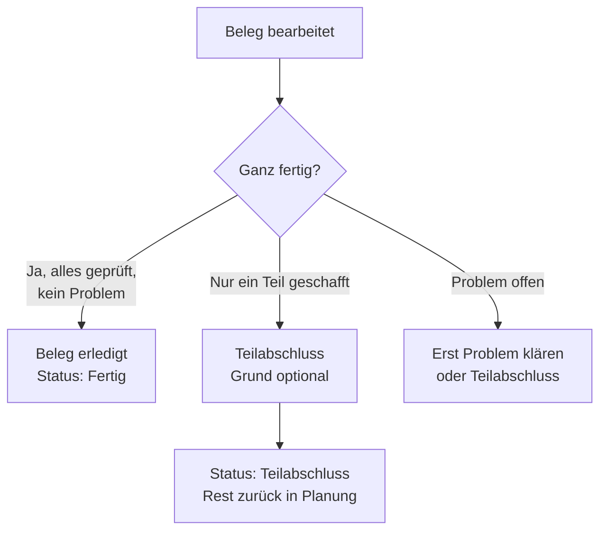

# A5 – Beleg erledigt vs. Teilabschluss

## Zweck

Einen Beleg abschließen – entweder ganz (`'Beleg erledigt'`) oder nur den bearbeiteten Teil
(`'Teilabschluss'`).

## Wann anwenden

Wenn du mit einem Beleg fertig bist (ganz oder teilweise).

## Voraussetzungen für „Beleg erledigt"

Der Knopf **`'Beleg erledigt'`** ist erst aktiv, wenn beide Bedingungen erfüllt sind. Sonst steht
oben `'Noch offen: …'`, z. B.:

- `'Noch nicht alle Positionen geprüft'` – setze alle Positionen auf `'Position geprüft ✓'`.
- `'Offenes Problem – erst klären'` – ein gemeldetes Problem blockiert; das klärt die Teamleitung.

## Beleg ganz abschließen

1. Alle Positionen geprüft, kein offenes Problem.
2. Tippe unten auf **`'Beleg erledigt'`**.
3. Der Beleg wird abgeschlossen (Tagwerk/ZST wird gesetzt) und du kommst zurück zum Startbildschirm.
   In deiner Liste steht der Beleg jetzt als **`'Fertig'`** (grün).

## Teilabschluss – nur einen Teil abschließen

Nutze das, wenn du **nur einen Teil** schaffst und der Rest später (meist am Folgetag) bearbeitet
wird.

1. Tippe unten auf **`'Teilabschluss'`**.
2. Es öffnet sich der Dialog `'Teilabschluss'` mit der Erklärung:
   `'Du schließt nur den bearbeiteten Teil ab. Der Beleg geht mit deinem Grund an die Teamleitung
   und kommt mit der Restware zurück in die Planung (in der Regel am nächsten Tag). In deiner Liste
   zählt er nicht als „Fertig", sondern als „Teilabschluss".'`
3. Trage optional im Feld `'Grund'` etwas ein (leer = „Teilabschluss").
4. Tippe **`'Teil abschließen'`** (oder `'Abbrechen'` zum Verwerfen).
5. Der Beleg steht danach als **`'Teilabschluss'`** (gelb) in deiner Liste – **nicht** als „Fertig".

## Was passiert danach

- **`'Beleg erledigt'`**: Beleg ist fertig, zählt in den Tagesfortschritt und wird beim
  Tagesabschluss übergeben.
- **`'Teilabschluss'`**: Der bearbeitete Teil ist gebucht, die Restware kommt zurück in die Planung
  (Teamleitung sieht das).
- Sind **alle** Belege deines Bündels geschlossen, zeigt der Startbildschirm `'Bündel fertig 🎉'`
  und den Knopf `'Nächstes Bündel holen'` (siehe Kapitel A7).

## Häufige Fehler / FAQ

- **`'Beleg erledigt'` ist grau** – lies die Zeile `'Noch offen: …'`. Meist fehlt eine geprüfte
  Position oder es gibt ein offenes Problem.
- **Ich habe zu früh „Teilabschluss" gewählt** – der Rest kommt zurück in die Planung; sprich mit
  der Teamleitung, wenn du doch weitermachen willst.
