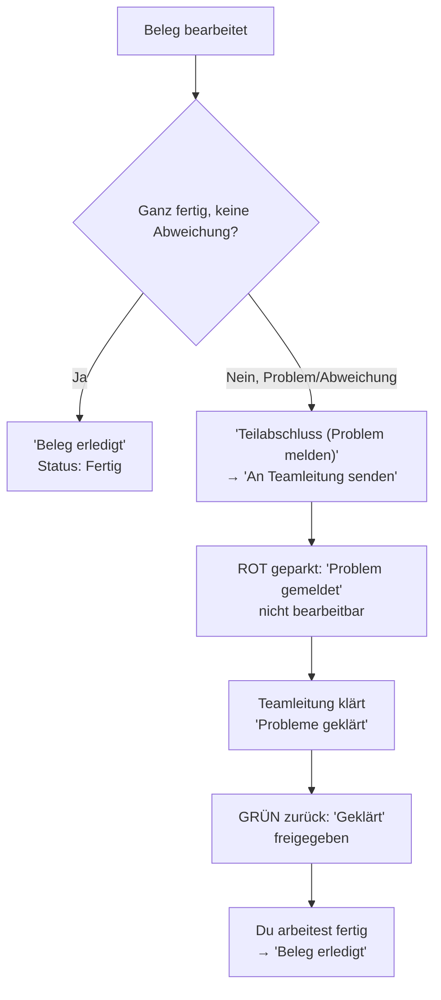

# A5 – Beleg erledigt vs. Teilabschluss

## Zweck

Einen Beleg abschließen – entweder ganz (`'Beleg erledigt'`) oder nur den bearbeiteten Teil
(`'Teilabschluss'`).

## Wann anwenden

Wenn du mit einem Beleg fertig bist (ganz oder teilweise).

## Voraussetzungen für „Beleg erledigt"

Der Knopf **`'Beleg erledigt'`** ist nur aktiv, wenn **alle** Positionen als `'Position geprüft ✓'`
markiert sind **und keine Abweichung/kein Problem** vorliegt. Sonst steht oben `'Noch offen: …'`
(z. B. `'Noch nicht alle Positionen geprüft'`). Liegt ein Problem vor (auch eine automatische
Mengen- oder Preisabweichung, Kapitel A4), bleibt nur der **`'Teilabschluss (Problem melden)'`**.

## Beleg ganz abschließen

1. Alle Positionen geprüft, keine Abweichung, kein Problem.
2. Tippe unten auf **`'Beleg erledigt'`**.
3. Der Beleg wird abgeschlossen (Tagwerk/ZST wird gesetzt) und du kommst zurück zum Startbildschirm.
   In deiner Liste steht der Beleg jetzt als **`'Fertig'`** (grün).

## Teilabschluss – Problem melden und weiterarbeiten

Nutze das, wenn ein **Problem** vorliegt (manuell erfasst oder automatisch durch eine Mengen-/
Preisabweichung). Der Knopf **`'Teilabschluss (Problem melden)'`** ist nur aktiv, wenn mindestens ein
Problem erfasst ist.

1. Tippe unten auf **`'Teilabschluss (Problem melden)'`**.
2. Es öffnet sich der Dialog **`'Teilabschluss mit Problemen'`** mit dem Hinweis:
   `'Der Vorgang geht mit den folgenden Problemen zur Fehlerbehebung an die Teamleitung. Bis zur
   Klärung bleibt er in deiner Liste rot geparkt und ist nicht bearbeitbar. Sobald die Teamleitung
   geklärt hat, kommt er grün markiert zu dir zurück.'`
3. Darunter siehst du **alle gesammelten Probleme** – manuelle Gründe **und** automatische
   (`'Mehrlieferung +<n>'`, `'Minderlieferung −<n>'`, `'Preisabweichung … VK-Etikett → korrigiert …'`).
4. Tippe **`'An Teamleitung senden'`** (oder `'Abbrechen'`). Ohne Problem steht hier der Hinweis
   `'Es ist noch kein Problem erfasst. Ohne Problem bitte „Beleg erledigt" verwenden.'`
5. Der Beleg liegt danach **rot** als **`'Problem gemeldet'`** in **deiner** Liste, mit dem Zusatz
   `'Wartet auf Klärung durch die Teamleitung – nicht bearbeitbar.'` – du kannst ihn **nicht** öffnen.

## Der Kreislauf: rot geparkt → grün geklärt → fertig

## Wenn der Beleg grün zurückkommt

1. Nach der Klärung liegt der Beleg **grün** als **`'Geklärt'`** in deiner Liste, mit dem Zusatz
   `'Geklärt – zur Weiterbearbeitung freigegeben.'`
2. Öffne ihn, arbeite den Rest ab und schließe ihn mit **`'Beleg erledigt'`** ab. Es ist derselbe
   Beleg beim selben Mitarbeiter – nichts wandert an fremde Kollegen.

## Was passiert danach

- **`'Beleg erledigt'`**: Beleg ist fertig, zählt in den Tagesfortschritt und wird beim
  Tagesabschluss übergeben.
- **`'Teilabschluss (Problem melden)'`**: die Probleme sind bei der Teamleitung, der Beleg bleibt rot
  geparkt bei dir, bis geklärt ist.
- Sind **alle** Belege deines Bündels geschlossen (fertig oder rot geparkt), zeigt der
  Startbildschirm `'Bündel fertig 🎉'` und den Knopf `'Nächstes Bündel holen'` bzw.
  `'Weiteres Bündel anfordern'` (siehe Kapitel A2/A7).

## Häufige Fehler / FAQ

- **`'Beleg erledigt'` ist grau** – lies die Zeile `'Noch offen: …'`. Meist fehlt eine geprüfte
  Position, oder es gibt eine Abweichung/ein Problem – dann geht es nur über den Teilabschluss.
- **`'Teilabschluss (Problem melden)'` ist grau** – es ist noch kein Problem erfasst. Ohne Problem
  nutzt du `'Beleg erledigt'`.
- **Der rote Beleg lässt sich nicht öffnen** – das ist so gewollt: er wartet auf die Klärung durch
  die Teamleitung und kommt danach grün zu dir zurück.
