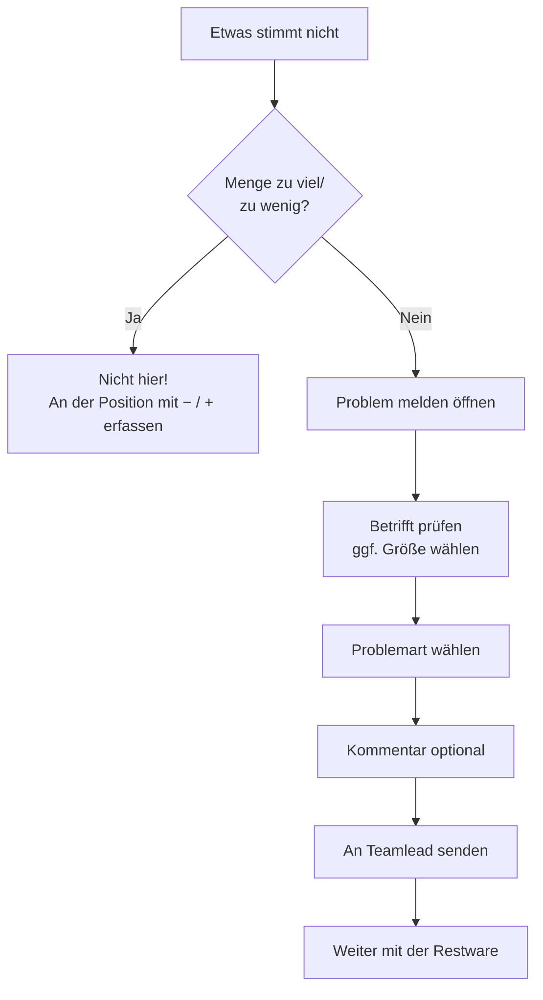

# A6 – Problem melden

> Dieses Kapitel ist **ein Beispiel-Ablauf unter vielen**. Der Problem-Ablauf ist wichtig, aber
> nicht wichtiger als die übrigen Kapitel.

## Zweck

Der Teamleitung melden, dass mit einem Beleg, einer Position oder einer Box etwas nicht stimmt –
und danach mit der Restware direkt weiterarbeiten.

## Wann anwenden

Wenn etwas nicht zur Vorgabe passt: falscher Artikel/Farbe/Größe, Schaden, fehlendes Paket,
Etiketten-, Sicherungs- oder Druckerproblem, oder Sonstiges.

> **Nicht** über „Problem melden" laufen **Mengenabweichungen** (zu viel/zu wenig geliefert). Die
> erfasst du direkt an der Position mit `'−'`/`'+'` (Kapitel A4).

## Voraussetzungen

- Der betroffene Beleg ist geöffnet.

## Schritt für Schritt

Du erreichst den Problem-Bildschirm auf zwei Wegen:

- unten am Beleg über **`'Problem melden'`** (betrifft den ganzen Beleg), **oder**
- an einer Position über den roten Knopf **`'Problem'`** (schon auf diese Position eingestellt).

Im Bildschirm `'Problem melden'`:

1. Oben siehst du unter **`'Betrifft:'`** worauf sich das Problem bezieht, z. B.
   `'Ganzer Beleg · WE <Nummer>'` oder `'Position <Nr> · <Artikel>'`.
2. Hat die Position mehrere Größen, kannst du über `'Genauer (optional)'` eine bestimmte Größe
   wählen (`'Ganze Position'` oder `'Größe <…> · EAN <…>'`).
3. Wähle bei **`'Problemart'`** den Grund. Zur Auswahl stehen: `'falscher Artikel'`,
   `'falsche Farbe'`, `'falsche Größe'`, `'beschädigt'`, `'Paket fehlt'`, `'Etikettenproblem'`,
   `'Sicherungsproblem'`, `'Druckerproblem'`, `'Sonstiges'`.
4. Optional: Schreibe etwas in `'Kommentar (optional)'`.
5. Tippe **`'An Teamlead senden'`** (erst aktiv, wenn eine Problemart gewählt ist).

Unten steht als Erinnerung: `'Nach dem Senden arbeitest du direkt mit der Restware weiter.'`

## Was passiert danach

- Das Problem geht an die Teamleitung (erscheint in deren Cockpit).
- Du kommst zum Beleg zurück und **arbeitest mit der Restware weiter**.
- Ein offenes Problem **blockiert** `'Beleg erledigt'` (`'Offenes Problem – erst klären'`), bis die
  Teamleitung es freigibt. Schaffst du den Rest schon fertig, kannst du stattdessen
  `'Teilabschluss'` nutzen.

## Was du hier **nicht** kannst

- Du kannst ein Problem **nicht selbst auflösen** – das macht die Teamleitung.
- Du kannst den Beleg **nicht selbst umverteilen oder stornieren**.
- Ein Foto-Upload ist nicht verfügbar; es steht nur der Hinweis `'Foto: optional'`.

## Häufige Fehler / FAQ

- **`'An Teamlead senden'` ist grau** – du hast noch keine `'Problemart'` gewählt.
- **Ich wollte eine Fehlmenge melden, finde sie aber nicht** – richtig: Fehl-/Mehrmengen gehören an
  die Position (`'−'`/`'+'`), nicht in diesen Bildschirm.
