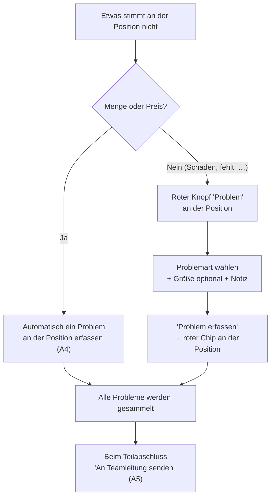

# A6 – Problem melden

> Dieses Kapitel ist **ein Beispiel-Ablauf unter vielen**. Der Problem-Ablauf ist wichtig, aber
> nicht wichtiger als die übrigen Kapitel.

## Zweck

An einer **Position** melden, dass etwas nicht stimmt (Schaden, falscher Artikel, fehlendes Paket,
Sonstiges). Die Probleme werden **gesammelt** und beim Teilabschluss an die Teamleitung gesendet
(Kapitel A5).

## Wann anwenden

Wenn etwas an einer Position nicht zur Vorgabe passt und **kein** reiner Mengen- oder Preisfall ist.

> **Automatisch ein Problem** – ohne diesen Dialog – sind eine **Mengenabweichung** (`'−'`/`'+'`) und
> eine **Preisabweichung** (Spalte `'VK korrigiert'`). Beides erfasst du direkt an der Position
> (Kapitel A4); die betroffene Zeile wird rot markiert.

## Voraussetzungen

- Der betroffene Beleg ist geöffnet, die Position ist sichtbar.

## Schritt für Schritt

Ein **beleg-weiter** „Problem melden"-Knopf existiert nicht mehr. Ein Problem gehört immer zu einer
**Position**:

1. Tippe in der Positions-Kopfzeile den roten Knopf **`'Problem'`**. Es öffnet sich der Dialog
   **`'Problem melden – Position <Nr>'`**.
2. Oben steht der Hinweis:
   `'Das Problem wird beim Teilabschluss gesammelt an die Teamleitung gesendet.'`
3. Wähle bei **`'Problemart'`** (Pflichtfeld) den Grund. Die Auswahl kommt aus dem Katalog, den die
   **Teamleitung** pflegt (Cockpit → `'Admin → Problemarten'`) – z. B. `'Beschädigt / Bruch'`,
   `'Falscher Artikel'`, `'Paket fehlt'`. Inaktive Gründe erscheinen nicht.
4. Optional bei **`'Größe (optional)'`** eine bestimmte Größe wählen (`'Ganze Position'` oder
   `'<Größe> · <EAN>'`).
5. Optional **`'Notiz (optional)'`** ausfüllen.
6. Tippe **`'Problem erfassen'`** (oder `'Abbrechen'`). An der Position erscheint danach ein **roter
   Chip** mit dem Grund (und ggf. der Notiz); über das `'×'` am Chip kannst du ihn wieder entfernen.

## Was passiert danach

- Die erfassten Probleme werden **lokal gesammelt** und **nicht sofort** gesendet.
- Beim **`'Teilabschluss (Problem melden)'`** gehen alle gesammelten Probleme gebündelt an die
  Teamleitung (Kapitel A5). Der Beleg liegt danach **rot** als `'Problem gemeldet'` bei dir und ist
  gesperrt, bis die Teamleitung `'Probleme geklärt'` hat.
- Solange ein Problem vorliegt, ist **`'Beleg erledigt'`** gesperrt – nur der Teilabschluss bleibt.

## Was du hier **nicht** kannst

- Du kannst ein Problem **nicht selbst auflösen** – das macht die Teamleitung.
- Du kannst den Beleg **nicht selbst umverteilen oder stornieren**.

## Häufige Fehler / FAQ

- **`'Problem erfassen'` ist grau** – du hast noch keine `'Problemart'` gewählt.
- **Ich finde meine Problemart nicht** – die Teamleitung pflegt den Katalog (`'Admin → Problemarten'`);
  inaktive Gründe sind nicht wählbar.
- **Ich wollte eine Fehlmenge/Preisabweichung melden** – die erfasst du direkt an der Position
  (`'−'`/`'+'` bzw. `'VK korrigiert'`), sie ist automatisch ein Problem.
- **Es gibt keinen „Problem melden"-Knopf unten am Beleg mehr** – richtig: Probleme gehören immer an
  eine Position (roter Knopf `'Problem'`).
