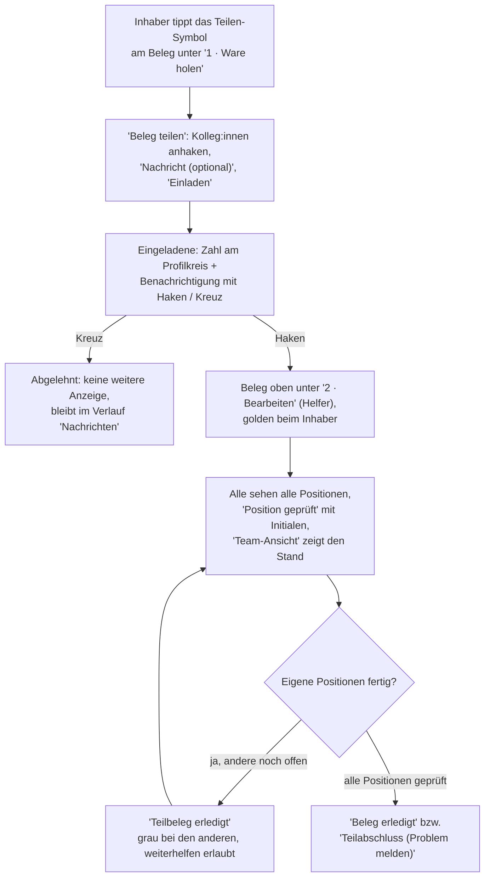

# A7 – Beleg teilen & gemeinsam bearbeiten

## Zweck

Einen Beleg **gemeinsam** mit Kolleg:innen bearbeiten: Du lädst sie ein, alle sehen denselben Beleg
mit **allen** Positionen, jeder hakt ab, was er geprüft hat – und die App zeigt euch gegenseitig, wie
weit ihr seid. Der Beleg bleibt dabei **ein** Beleg in **einem** Bündel.

## Wann anwenden

- Ein Beleg ist zu groß oder zu eilig für eine Person allein (viele Positionen, der Termin drängt).
- Kolleg:innen haben Luft und wollen mithelfen – ohne dass die Teamleitung den Beleg erst in
  Teil-Belege zerlegen muss.
- Die Teamleitung hat einen Beleg von vornherein mehreren Personen gemeinsam zugewiesen – dann bist
  du auch ohne eigene Einladung beteiligt (siehe unten).

## Voraussetzungen

- Der Beleg liegt in deinem Bündel – zugeteilt, in Arbeit oder nach einer Klärung geklärt
  (Kapitel A2/A3). Ein rot geparkter Problemfall lässt sich nicht teilen.
- Die Kolleg:innen, die du einlädst, sind im System aktiv; die Liste zeigt dir, wer
  `'heute im Dienst'` ist.

## Geteilt ist nicht aufgeteilt

Zwei ähnliche Wörter, zwei verschiedene Dinge:

| | **Geteilter Beleg** (dieses Kapitel) | **Aufgeteilter Beleg** (macht die Teamleitung) |
|---|---|---|
| Was passiert | **Ein** Beleg, mehrere Personen. Alle sehen **alle** Positionen. | Ein großer Beleg wird in **eigenständige Teil-Belege** zerlegt (`'WE-… (1)'`, `'WE-… (2)'`). |
| Wer holt die Ware | **Alle Beteiligten** – jede:r holt die Ware bzw. ihren/seinen Teil davon und hakt selbst ab. Der Beleg bleibt trotzdem im Bündel des Inhabers. | Jeder holt die Ware seines eigenen Teil-Belegs. |
| Woran du es erkennst | Goldene Markierung mit `'Geteilt mit <Name>'` bzw. `'Geteilt · <n> Personen'`. | Ein ganz normaler Beleg mit Teil-Nummer. |

Im geteilten Beleg gibt es zwei Rollen:

- **Inhaber** – die Person, in deren Bündel der Beleg liegt. Sie holt die Ware und hakt ihren
  Lagerplatz-Stop ab (Kapitel A2).
- **Helfer** – alle Eingeladenen, die angenommen haben. Der Beleg liegt **nicht** in ihrem Bündel;
  sie finden ihn auf dem Startbildschirm unter **`'2 · Bearbeiten'`**, dort **ganz oben** vor den
  eigenen Belegen, golden eingefasst und mit `'Geteilt mit <Name des Inhabers>'`.

**Auch Helfer holen die Ware.** Der geteilte Beleg steht bei ihnen ebenfalls unter
`'1 · Ware holen'`, dort **ganz oben** und golden markiert: Jede:r holt die Ware bzw. ihren/seinen
Teil davon und hakt **den eigenen** Stop ab – der Haken der anderen zählt nicht für dich, und deiner
nicht für sie. Solange dein Haken fehlt, bleibt der Beleg unter `'2 · Bearbeiten'` ausgegraut, genau
wie ein eigener. Liegt die Ware schon auf dem Tisch, tippst du den Stop einfach ab.

## Kolleg:innen einladen (`'Beleg teilen'`)

1. Unter `'1 · Ware holen'` trägt jeder Beleg am rechten Rand einen runden Knopf mit dem
   **Teilen-Symbol** (Kasten mit Pfeil nach oben, `'Beleg teilen'`) – er schwebt direkt **über** dem
   Status-Chip `'offen'` / `'geholt'`, der weiterhin mittig zur Karte steht. Tippe den Knopf an; der
   Stop wird dadurch **nicht** abgehakt.
   Ist ein Beleg fertig, verschwindet er aus der Liste – teilen lässt er sich dann nicht mehr.
2. Es öffnet sich **`'Beleg teilen'`**: eine Liste aller aktiven Kolleg:innen mit einem Haken links,
   den Initialen, dem Namen und – wer heute eingeteilt ist – dem Zusatz `'heute im Dienst'`. Wer
   schon beteiligt oder eingeladen ist, ist markiert und lässt sich nicht erneut anhaken.
3. Hake eine oder mehrere Personen an. Optional schreibst du unter **`'Nachricht (optional)'`** ein
   paar Worte dazu (z. B. „Ich mache Position 1–4, magst du den Rest?“).
4. Tippe **`'Einladen'`** – der Knopf zeigt, wie viele Personen du einlädst.

Einladen darf der Inhaber – und jeder, der bereits aktiv am Beleg beteiligt ist. Eine Einladung ist
**keine** Zuweisung: Der Beleg bleibt bei dir, die Eingeladenen entscheiden selbst, ob sie mitmachen.

## Eine Einladung bekommen

Wirst du eingeladen, passieren zwei Dinge, solange deine App geöffnet ist:

- Am **Profilkreis** oben rechts (deine Initialen) erscheint eine **Zahl**. Sie zählt deine offenen
  Einladungen und die ungelesenen Nachrichten der Teamleitung zusammen.
- Oben erscheint eine **Bildschirm-Benachrichtigung**: „*Name* lädt dich ein, WE *Nummer* gemeinsam
  zu bearbeiten“, darunter die Nachricht, falls eine mitgeschickt wurde. Links eine runde **grüne**
  Taste mit **Haken**, rechts eine runde **rote** Taste mit **Kreuz**.

Die Benachrichtigung **bleibt stehen, bis du reagierst** – nichts blinkt kurz auf und ist wieder weg.
Liegen mehrere Einladungen vor, siehst du zuerst die älteste; die nächste folgt, sobald du geantwortet
hast.

- **Haken – annehmen:** Der Beleg erscheint bei dir unter `'2 · Bearbeiten'` **ganz oben**, vor
  deinen eigenen Belegen. Du kannst ihn sofort öffnen – ausgegraut ist er nie. Die Ware holt der
  Inhaber – hol dir dort deinen Teil der Ware und hak den Stop ab. Ist der Beleg fertig,
  verschwindet er wieder.
- **Kreuz – ablehnen:** Du wirst nicht weiter behelligt. Die Einladung bleibt nur in deinem Verlauf
  unter `'Nachrichten'` stehen. Der Inhaber kann dich später erneut einladen.

Solange du weder Haken noch Kreuz getippt hast, siehst du den Beleg **nicht**.

## `'Nachrichten'` – dein Verlauf

Tippe auf den **Profilkreis**. Das Menü zeigt deinen Namen und deine Mitarbeiternummer, darunter
`'Zur Teamlead-App'`, **`'Nachrichten'`** und `'Abmelden'`.

`'Nachrichten'` öffnet deinen Verlauf:

- Auf einem **breiten** Bildschirm (Tablet quer) bleibt **links** deine Übersicht mit
  `'1 · Ware holen'` und `'2 · Bearbeiten'` stehen, **rechts** erscheint schmal der Verlauf.
- Auf dem **Handy** siehst du nur den Verlauf, mit einer Zurück-Taste.

Im Verlauf stehen – neueste zuerst, jeweils mit Uhrzeit, Absender und Beleg:

- **erhaltene Einladungen** mit ihrem Stand: offen (Haken und Kreuz direkt im Eintrag), angenommen,
  abgelehnt oder entfernt (wenn die Teamleitung dich aus dem Beleg genommen hat);
- **gesendete Einladungen** mit der Reaktion der Kolleg:innen;
- **Nachrichten der Teamleitung**, die du mit `'Gelesen'` quittierst.

## Gemeinsam bearbeiten

Öffne den Beleg wie gewohnt über seine Karte (Kapitel A3). Für alle Beteiligten gilt dasselbe:

- **Alle sehen alle Positionen** – niemand bekommt nur einen Ausschnitt. Sprecht euch ab, wer welche
  Positionen übernimmt.
- **`'Position geprüft'`** zeigt zusätzlich die **Initialen** der Person, die geprüft hat. Der Haken
  wird sofort gespeichert, ist für alle sichtbar und bleibt auch nach einem Neuladen der Seite
  erhalten. Dasselbe gilt für die Ist-Mengen (`'−'` / `'+'`) und den Preis in `'Etikettpreis'`
  (Kapitel A4): Was einer erfasst, sehen alle.
- Das Ware-holen-Häkchen setzt **nur der Inhaber** (Kapitel A2).

### `'Team-Ansicht'`

Oben rechts im Beleg-Bildschirm findest du den Umschalter **`'Team-Ansicht'`**. Er teilt den
Bildschirm:

- **Links** – mindestens die halbe Breite – bleibt deine eigene Positionstabelle; du arbeitest
  normal weiter.
- **Rechts** steht ganz oben der **`'Gesamtfortschritt'`** des BELEGS: ein goldener Balken mit
  Prozentzahl und darunter `'<erledigt>/<gesamt> Teile · <geprüft>/<gesamt> Positionen – alle
  Beteiligten zusammen'`. Gezählt wird in **Teilen** (Stückzahl), weil eine Position mit 40 Teilen
  mehr Arbeit ist als eine mit zweien; deine eigenen Haken zählen mit.
- Darunter siehst du die anderen Beteiligten:
  - Bei **einer** anderen Person: ihr Name, ihr Stand (`'Inhaber'`, `'hilft'` oder – grau –
    `'Teil erledigt'`), ein Fortschrittsbalken „geprüft von gesamt“ und die Nummern der Positionen,
    die sie geprüft hat.
  - Bei **mehreren**: ein Raster aus Kästchen (Initialen, Name, Fortschritt). Tippe ein Kästchen an,
    um die Einzelansicht zu sehen; **`'Zurück zur Übersicht'`** bringt dich zum Raster.
- Hakt jemand gerade eine Position ab oder ändert eine Menge, **leuchtet sein Kästchen kurz auf**
  (etwa anderthalb Sekunden). So siehst du, wo gerade gearbeitet wird, ohne nachzufragen.

Ein erneuter Tipp auf `'Team-Ansicht'` schließt die geteilte Ansicht wieder.

## `'Teilbeleg erledigt'` – dein Anteil ist fertig

Bei einem geteilten Beleg heißt der Hauptknopf unten zunächst **`'Teilbeleg erledigt'`** statt
`'Beleg erledigt'`:

1. Bist du mit deinen Positionen durch, tippe **`'Teilbeleg erledigt'`**.
2. Bei den anderen wirst du in der `'Team-Ansicht'` **grau** als `'Teil erledigt'` gezeigt. Am
   Beleg selbst ändert sich nichts – er ist erst fertig, wenn **alle** Positionen geprüft sind.
3. Unten steht jetzt `'Dein Teil ist erledigt – die anderen arbeiten weiter'`. Du darfst trotzdem
   weiter mithelfen und Positionen abhaken.
4. Sind **alle** Positionen geprüft, heißt der Hauptknopf für **jeden** Beteiligten
   **`'Beleg erledigt'`** – wer ihn tippt, schließt den Beleg für alle ab. Gibt es Probleme, bleibt
   wie gewohnt **`'Teilabschluss (Problem melden)'`** (Kapitel A5).

Für den Abschluss eines geteilten Belegs prüft die App zwei feste Regeln:

- **`'Beleg erledigt'`** geht nur, wenn **jede** Position geprüft ist – egal von wem.
- **`'Teilabschluss (Problem melden)'`** geht nur, wenn jede **ungeprüfte** Position ein gemeldetes
  oder automatisch erkanntes Problem hat (Mehr-/Mindermenge, Preiskorrektur, Problemmeldung). Ist
  eine Position einfach noch offen, weist die App den Abschluss ab und nennt dir die Zahl der noch
  ungeprüften Positionen.

**Leistung:** Beim Tagesabschluss zählt für dich die Menge der Positionen, die **du** geprüft hast –
nicht der ganze Beleg. `'Teilbeleg erledigt'` allein bucht noch nichts; gezählt wird beim Abschluss
des Belegs.

## Nächstes Pack anfordern

- **Inhaber:** Sobald du `'Teilbeleg erledigt'` gemeldet hast, hält dich der geteilte Beleg nicht
  mehr davon ab, dir mit `'Nächstes Pack anfordern'` neue Arbeit zu holen – vorausgesetzt, in deinem
  laufenden Pack ist sonst nichts mehr offen (Kapitel A8).
- **Helfer:** Der geteilte Beleg liegt nicht in deinem Bündel und zählt für dein Pack nicht mit.
- **Regel der Teamleitung:** Hat die Teamleitung `'Beim geteilten Beleg erst mithelfen'`
  eingeschaltet, gilt für Inhaber **und** Helfer: Solange am geteilten Beleg noch Positionen offen
  sind, bekommst du beim Anfordern die Meldung
  **`'Erst den geteilten Beleg zu Ende bringen – es sind noch Positionen offen.'`** Erst wenn der
  Beleg fertig ist – oder mit Problemen zur Klärung bei der Teamleitung liegt – geht es weiter.

## Wenn die Teamleitung eingreift

- Die Teamleitung kann einzelne **Helfer aus dem geteilten Beleg entfernen** (im Cockpit
  `'Aus geteiltem Beleg entfernen'`, mit Grund). Der Beleg verschwindet dann aus deinem
  `'2 · Bearbeiten'`; im Verlauf unter `'Nachrichten'` steht die Einladung als **entfernt**. Deine
  bereits geprüften Positionen bleiben geprüft.
- Die Teamleitung kann einen Beleg von Anfang an mehreren Personen **gemeinsam zuweisen**. Dann bist
  du ohne Einladung beteiligt: Die zuerst gewählte Person ist Inhaber (der Beleg liegt in ihrem
  Bündel), alle anderen finden ihn oben unter `'2 · Bearbeiten'`.
- Wird der Beleg dem Inhaber **entzogen**, zu jemand anderem **verschoben**, **storniert** oder
  **geparkt** – auch durch `'Rest parken'` (Kapitel A2) –, endet die Zusammenarbeit für alle. Was
  geprüft war, bleibt geprüft.

## Der Ablauf im Überblick

## Was passiert danach

- Der Beleg gilt als fertig, sobald **alle** Positionen geprüft sind und jemand `'Beleg erledigt'`
  tippt – er steht dann bei allen Beteiligten als `'Fertig'`.
- Beim Teilabschluss liegt der Beleg wie gewohnt zur Klärung bei der Teamleitung (Kapitel A5); die
  Beteiligung bleibt bestehen, nach der Klärung arbeitet ihr gemeinsam weiter.
- Die Teamleitung sieht im Cockpit an der goldenen Karte, dass an dem Beleg zusammengearbeitet wird –
  und auch später noch, dass zusammengearbeitet **wurde**. In der Mitarbeiter-Matrix taucht der Beleg
  zusätzlich in **deiner** Spalte auf – in deinem aktiven Pack unter `'Laufend'` bzw. `'Geplant'`,
  golden und mit `'Mithilfe bei <Inhaber>'`.
- Deine Leistung wird beim Tagesabschluss anteilig nach deinen geprüften Positionen gezählt.

## Häufige Fehler / FAQ

- **Ich sehe kein Teilen-Symbol** – es gibt es nur an Belegen unter `'1 · Ware holen'` und nicht
  bei rot geparkten Problemfällen. An einem geteilten Beleg, an dem du beteiligt bist, steht es
  ebenfalls: Auch Helfer dürfen weitere Kolleg:innen einladen.
- **Der geteilte Beleg ist unter `'2 · Bearbeiten'` ausgegraut** – du hast deinen eigenen
  Ware-holen-Stop noch nicht abgehakt. Er steht oben unter `'1 · Ware holen'`; ein Tipp darauf gibt
  den Beleg frei. Dass ein anderer Beteiligter schon abgehakt hat, zählt nicht für dich.
- **`'Beleg erledigt'` ist grau, obwohl ich fertig bin** – bei einem geteilten Beleg müssen **alle**
  Positionen geprüft sein, auch die der anderen. Melde deinen Anteil mit `'Teilbeleg erledigt'` und
  hilf weiter oder hol dir Neues.
- **Ich bekomme kein neues Pack** – lies die Meldung. Steht dort `'Erst den geteilten Beleg zu Ende
  bringen – es sind noch Positionen offen.'`, gilt die Regel der Teamleitung: Hilf am geteilten Beleg
  weiter, bis alle Positionen geprüft sind.
- **Eine Position ist plötzlich wieder ungeprüft** – ein anderer Beteiligter hat den Haken
  zurückgenommen (ein Tipp auf einen gesetzten Haken nimmt ihn zurück – für alle). Sprecht euch über
  die `'Team-Ansicht'` ab, wer welche Positionen übernimmt.
- **Der geteilte Beleg ist aus `'2 · Bearbeiten'` verschwunden** – die Teamleitung hat dich entfernt oder die
  Zusammenarbeit beendet (Beleg entzogen, verschoben oder geparkt). Den Stand siehst du unter
  `'Nachrichten'`.
- **Die Benachrichtigung ist weg, obwohl ich nichts getippt habe** – die Zusammenarbeit wurde
  beendet, bevor du reagiert hast (z. B. Beleg entzogen oder geparkt). Frag im Zweifel den Inhaber.
