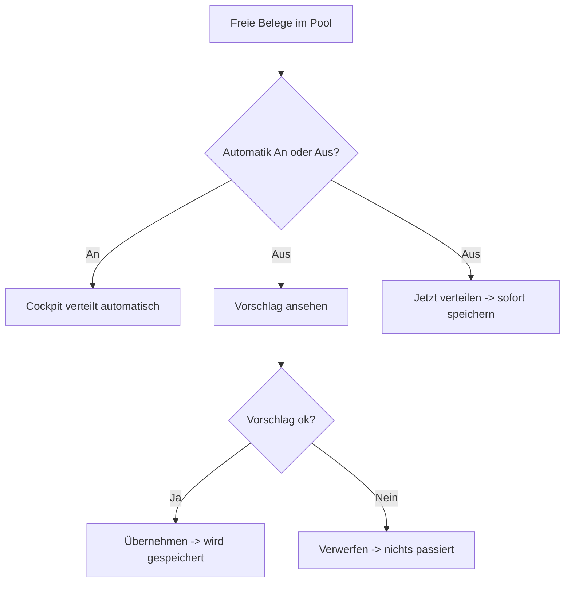

# B1 – Tagescockpit

## Zweck

Das Tagescockpit ist die Startseite der Teamleitung: Überblick über Kapazität, Pool und Fortschritt,
Steuerung der Automatik und Auslöser für die Neuverteilung.

## Wann anwenden

Zu Schichtbeginn, nach jedem Wareneingang-Schub und immer, wenn Sie den Tagesstand prüfen wollen.

## Voraussetzungen

- Angemeldet im Cockpit; Navigationseintrag `'Tagescockpit'`.

## Aufbau der Seite

Die Seite trägt die Überschrift `'Heute – Logistik Warenauszeichnung'` mit dem Datum. Oben rechts
finden Sie die Steuerung, darunter Kennzahlen-Blöcke.

### Automatik ein-/ausschalten

- Der Schalter zeigt `'Automatik An'` oder `'Automatik Aus'` (Standard: An, bleibt gespeichert).
- **`'Automatik An'`**: „Neue Belege werden automatisch nach Schichtplan + Priorität verteilt.
  Laufende & manuell gesetzte Arbeit bleibt unangetastet." Das Cockpit verteilt selbstständig, wenn
  freie Belege auflaufen.
- **`'Automatik Aus'`**: „Neue Belege sammeln sich. Du prüfst den Vorschlag und übernimmst selbst."

### Knöpfe oben rechts

- **`'Jetzt verteilen'`** – erscheint nur bei `'Automatik Aus'`. Verteilt die freien Belege sofort.
- **`'Vorschlag ansehen'`** – öffnet einen Vorschau-Dialog (siehe unten), ohne etwas zu speichern.
- **`'Zum Board'`** – wechselt zum Mitarbeiterboard (Kapitel B3).

### Plan-Status (farbige Zeile)

- `'● Plan aktuell'` – nichts offen (ggf. mit `'· zuletzt verteilt <n> Belege'`).
- `'⏳ verteilt …: <n> freier Beleg'` (bei Automatik An) bzw.
  `'⏳ Vorschlag verfügbar: <n> freie Belege'` (bei Automatik Aus) – es wartet Arbeit.

### „Braucht dich"-Leiste

Gibt es Ausnahmen, erscheint eine Warnleiste mit `'Braucht dich:'`, z. B. `'<n> Probleme'`,
`'<Namen> ausgelastet ≥ 90%'` oder `'Überbucht'`, plus Knopf `'Ansehen'` (führt zum Board).

## Die Kennzahlen (was sie bedeuten)

**Block `'Kapazität'`**

| Kennzahl | Bedeutung |
|---|---|
| `'Geplante MA'` | Anzahl heute eingeplanter Mitarbeitender. |
| `'Netto-Kapazität'` | Verfügbare Arbeitszeit gesamt (z. B. „2 h 18 min"). |
| `'Verplant'` | Bereits eingeplante Zeit. |
| `'Freie Kapazität'` | Noch freie Zeit (rot, wenn ≤ 0). |
| `'Auslastung'` | Auslastung in Prozent. |

**Block `'Pool'`** (freie, verteilbare Belege)

Ist alles verteilt: `'Kein freier Pool – alle verteilbaren Belege sind zugeteilt.'` Sonst:

| Kennzahl | Bedeutung |
|---|---|
| `'Frei (verteilbar)'` | offene, verteilbare Belege. |
| `'Überfällig'` | überfällige Belege (rot, wenn > 0). |
| `'Prio'` | priorisierte Belege. |
| `'CatMan fällig'` | CatMan-fällige Belege (nur Anzeige). |
| `'Probleme offen'` | offene Problemfälle. |

Sind zugeteilte Belege trotz beendeter Schicht offen, erscheint der Warnhinweis
`'<n> Beleg(e) noch offen, obwohl die Schicht des zugeteilten Mitarbeiters beendet ist – bitte vor
Schichtende klären (keine offene Ware über Nacht).'`

**Block `'ZST-Fortschritt'`** – Fortschrittsbalken plus `'Belege fertig'` (`<fertig> / <gesamt>`),
`'Teile fertig'`, `'Aufwandspunkte'`, `'Teile/h'`, `'Punkte/h'`.

**Block `'Letzte Eingriffe & Verteilungen'`** – protokollierte manuelle Eingriffe des Tages, oder
`'Noch keine Eingriffe heute.'`

## Neu verteilen / Vorschlag ansehen

**Vorschlag-Dialog** (`'Vorschlag ansehen'`): Titel `'Verteilungs-Vorschlag'`. Während der
Berechnung: `'Engine berechnet den Vorschlag…'`. Sie sehen die Kennzahlen `'Bündel'`,
`'Zugewiesen'`, `'Nicht zuteilbar'` und eine Tabelle mit `'Mitarbeiter'`, `'Bündel'`, `'Verplant'`,
`'Kapazität'`, `'Auslastung'`, `'Punkte'`. Fußnote:
`'Vorschau – es wird nichts gespeichert. Erst „Übernehmen" schreibt die Verteilung.'` Über
`'Übernehmen'` speichern Sie, über `'Verwerfen'` verwerfen Sie.

> **Wichtig:** „Neu verteilen" ist ungefährlich mehrfach ausführbar. Es setzt nur **noch nicht
> begonnene** zugeteilte Belege zurück in den Pool und rechnet neu. **Laufende, teilweise
> abgeschlossene und fertige Arbeit bleibt unangetastet**, ebenso manuelle Zuweisungen.

## Was passiert danach

- Nach Verteilung: Chip `'Verteilt'` + `'<n> zugeteilt · <n> Bündel · <n> offen'`.
- Die Mitarbeitenden sehen ihre Bündel in der Mitarbeiter-App.

## Häufige Fehler / FAQ

- **`'Verteilung fehlgeschlagen: …'`** – erneut versuchen; hält es an, technische Ursache prüfen
  (siehe Kapitel B8 zur Dev-Umgebung).
- **`'Jetzt verteilen'` fehlt** – die Automatik steht auf `'Automatik An'`; der Knopf erscheint nur
  bei `'Automatik Aus'`.
