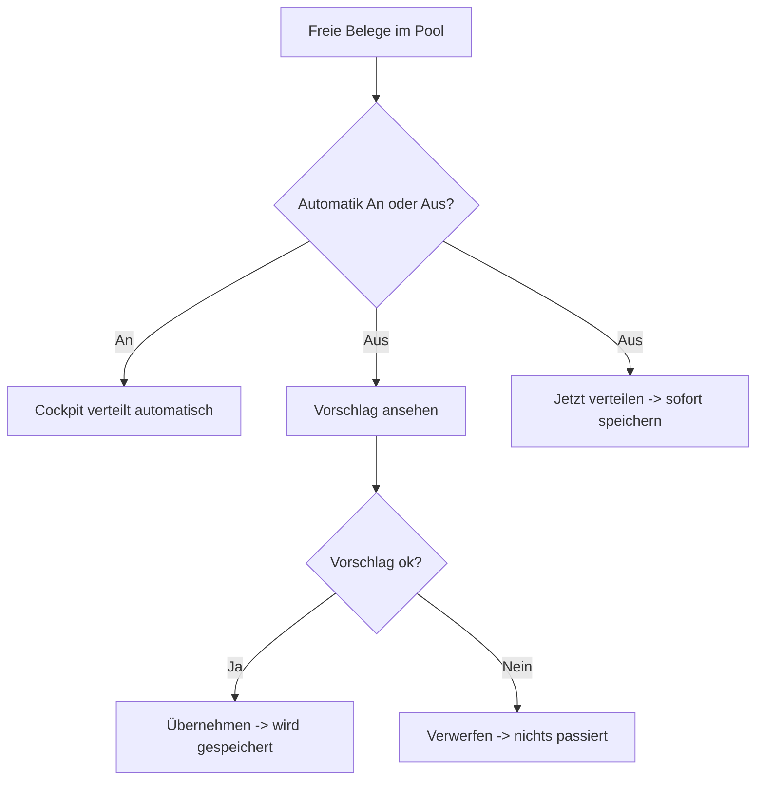

# B1 – Tagescockpit

## Zweck

Das Tagescockpit ist die Startseite der Teamleitung: Überblick über Kapazität, Pool und Fortschritt,
Steuerung der Automatik und Auslöser für die Neuverteilung.

## Wann anwenden

Zu Schichtbeginn, nach jedem Wareneingang-Schub und immer, wenn Sie den Tagesstand prüfen wollen.

## Voraussetzungen

- Angemeldet im Cockpit; Navigationseintrag `'Tagescockpit'`.

## Aufbau der Seite

Seit dem Redesign (siehe `docs/mockups/tagescockpit/README.md`) ist das Tagescockpit eine
Steuerzentrale: jedes Element ist entweder eine Live-Kennzahl mit echter Bedeutung oder eine
anklickbare Entscheidung — keine reinen Zähl-Kacheln mehr. Die Überschrift ist ein Statussatz
(`'Läuft rund'` bzw. `'Läuft — <n> Dinge brauchen dich'`), darunter die Eyebrow
`'Automatik-Dispo · <Datum>'` und die Plan-Status-Zeile. Oben rechts finden Sie die Steuerung.

### Automatik ein-/ausschalten

- Der Schalter zeigt `'Automatik An'` oder `'Automatik Aus'` (Standard: An, bleibt gespeichert).
- **`'Automatik An'`**: „Neue Belege werden automatisch nach Schichtplan + Priorität verteilt.
  Laufende & manuell gesetzte Arbeit bleibt unangetastet." Das Cockpit verteilt selbstständig, wenn
  freie Belege auflaufen.
- **`'Automatik Aus'`**: „Neue Belege sammeln sich. Du prüfst den Vorschlag und übernimmst selbst."

### Knöpfe oben rechts

- **`'Jetzt verteilen'`** – erscheint nur bei `'Automatik Aus'`. Verteilt die freien Belege sofort.
- **`'Vorschlag ansehen'`** – öffnet einen Vorschau-Dialog (siehe unten), ohne etwas zu speichern.
- **`'Zum Board'`** – wechselt zum Mitarbeiterboard (Kapitel B3).

### Plan-Status (farbige Zeile)

- `'● Plan aktuell'` – nichts offen (ggf. mit `'· zuletzt verteilt <n> Belege'`).
- `'⏳ verteilt …: <n> freier Beleg'` (bei Automatik An) bzw.
  `'⏳ Vorschlag verfügbar: <n> freie Belege'` (bei Automatik Aus) – es wartet Arbeit.

### Verteilungsstatus (Balken)

Ein zweigeteilter Balken zeigt, wie sich die heutigen Belege aufteilen: `'<n> verteilt'` (bereits
zugeteilt oder fertig) und `'<n> im Pool'` (noch frei, wartet auf die Automatik). Gibt es offene
Problemfälle, erscheint darunter der Chip `'<n> davon mit offenem Problem'`.

### „Braucht dich jetzt"

Ersetzt die frühere Warnleiste durch eine Liste konkreter, anklickbarer Fälle — nur was wirklich
eine Entscheidung braucht, z. B.:

| Eintrag | Bedeutung | Ziel |
|---|---|---|
| `'Probleme offen'` | Belege mit gemeldetem Problem. | Digitale Ablagen |
| `'Überbucht'` | Verplant übersteigt Netto-Kapazität. | Mitarbeiterboard |
| `'Topf — aus Automatik ausgeschlossen'` | Manuell geparkte Belege. | Digitale Ablagen |
| `'Unvollständige Lieferung(en)'` | Lieferung noch nicht vollständig erfasst. | Digitale Ablagen |
| `'Ausgelastet ≥ 90%'` | Mitarbeitende nahe/über Kapazitätsgrenze. | Mitarbeiterboard |
| `'Offen trotz Schichtende'` | Zugeteilter Mitarbeiter hat bereits Feierabend. | Mitarbeiterboard |

Ist die Liste leer: `'Nichts wartet auf dich — die Automatik hat alles verteilt.'`

### „Frei & wartend"

Kurzliste der Mitarbeitenden ohne aktuelles Bündel (Name + Bereiche als Chip). Klick führt zum
Mitarbeiterboard, wo die Zuteilung im Detail passiert — das Cockpit selbst weist nichts zu.

## Die Kennzahlen (was sie bedeuten)

**Block `'ZST-Fortschritt'`** – Fortschrittsbalken plus `'<fertig> / <gesamt> Belege'` und Prozent,
darunter `'Teile fertig'`, `'Teile/h'` und `'freie Kapazität'` als schlanke Zeile (die übrigen
Kapazitäts-/Pool-Kennzahlen im Detail liefern weiterhin Mitarbeiterboard und Digitale Ablagen, um
Dopplung zu vermeiden).

**Block `'Letzte Eingriffe & Verteilungen'`** – protokollierte manuelle Eingriffe des Tages, oder
`'Noch keine Eingriffe heute.'`

## Neu verteilen / Vorschlag ansehen

**Vorschlag-Dialog** (`'Vorschlag ansehen'`): Titel `'Verteilungs-Vorschlag'`. Während der
Berechnung: `'Engine berechnet den Vorschlag…'`. Sie sehen die Kennzahlen `'Bündel'`,
`'Zugewiesen'`, `'Nicht zuteilbar'` und eine Tabelle mit `'Mitarbeiter'`, `'Bündel'`, `'Verplant'`,
`'Kapazität'`, `'Auslastung'`, `'Punkte'`. Fußnote:
`'Vorschau – es wird nichts gespeichert. Erst „Übernehmen" schreibt die Verteilung.'` Über
`'Übernehmen'` speichern Sie, über `'Verwerfen'` verwerfen Sie.

> **Wichtig:** „Neu verteilen" ist ungefährlich mehrfach ausführbar. Es setzt nur **noch nicht
> begonnene** zugeteilte Belege zurück in den Pool und rechnet neu. **Laufende, teilweise
> abgeschlossene und fertige Arbeit bleibt unangetastet**, ebenso manuelle Zuweisungen.

## Was passiert danach

- Nach Verteilung: Chip `'Verteilt'` + `'<n> zugeteilt · <n> Bündel · <n> offen'`.
- Die Mitarbeitenden sehen ihre Bündel in der Mitarbeiter-App.

## Häufige Fehler / FAQ

- **`'Verteilung fehlgeschlagen: …'`** – erneut versuchen; hält es an, technische Ursache prüfen
  (siehe Kapitel B8 zur Dev-Umgebung).
- **`'Jetzt verteilen'` fehlt** – die Automatik steht auf `'Automatik An'`; der Knopf erscheint nur
  bei `'Automatik Aus'`.
