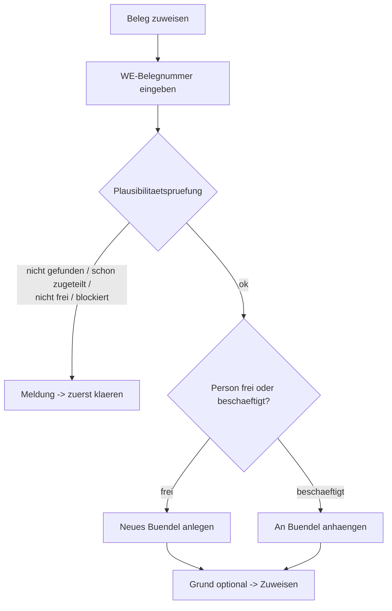

# B3 – Mitarbeiterboard

## Zweck

Das Mitarbeiterboard zeigt, wer an was arbeitet, wie ausgelastet jede Person ist, und lässt Belege
manuell zuweisen, entziehen, umsortieren oder pausieren.

## Wann anwenden

Zum Überblick über die Mannschaft, bei Engpässen/Überlast und für gezielte manuelle Eingriffe.

## Voraussetzungen

- Navigationseintrag `'Mitarbeiterboard'`.

## Eine Zeile lesen

Jede Person ist eine aufklappbare Zeile. Die Kopfzeile zeigt:

- den Namen und eine **Skill-Stufe** als Chip (Tooltip `'Skill-Stufe: <Stufe>'`): `'Profi'`,
  `'Fortgeschritten'`, `'Basis'`, `'Starter'` oder `'Dummy'`;
- bei `'Starter'`/`'Dummy'` zusätzlich `'nur manuelle Zuteilung'`;
- bei freier Person `'frei'`;
- die Last: `'<n> Teile'`, Chip `'<Prozent> % verplant'` (Warnung > 95 %), `'<h> h geplant'`, die
  Bereiche und `'<n> Pkt · schwer <x>/leicht <y>'`;
- offene Probleme als Chip und den Bündel-Fortschritt `'Beleg <i>/<gesamt>'`;
- bei Pause den Chip `'Pausiert'`.

**Skill-Stufen verstehen:** Nur `'Profi'`, `'Fortgeschritten'` und `'Basis'` bekommen von der
Automatik **automatisch** Arbeit. `'Starter'` und `'Dummy'` erhalten **nur manuell** zugeteilte
Belege (kein Selbst-Nachziehen). Die Stufe steuert nur die Auto-Berechtigung – die Leistungsmessung
ist davon getrennt (siehe Temp-Kräfte in Kapitel B7).

## Aufgeklappte Zeile

Ist niemandem etwas zugewiesen: `'Frei — keine Belege zugewiesen.'` Sonst je Beleg: laufende Nummer,
Pfeile `'Nach oben'`/`'Nach unten'` (Reihenfolge), WE-Nr, Status, Lieferung, `'<n> Teile'`, Knopf
`'Details'` und `'Entziehen'` (rot). Unten:

- **`'Beleg zuweisen'`** (bzw. `'Beleg zuweisen & Bündel anlegen'`, wenn die Person frei ist);
- **`'Reihenfolge speichern'`** (aktiv, sobald umsortiert);
- **`'Pause/Abwesenheit'`** bzw. `'Pause beenden'`.

## Beleg per WE-Nummer zuweisen (mit Plausibilitätsprüfung)

1. In der aufgeklappten Zeile `'Beleg zuweisen'` (bzw. `'Beleg zuweisen & Bündel anlegen'`) klicken.
   Es öffnet der Dialog `'Beleg zuweisen — <Name>'`.
2. Geben Sie die **`'WE-Belegnummer'`** ein (Beispiel: `'z. B. WE-2026-01234'`). Der Beleg wird
   **live geprüft** (`'Beleg wird geprüft …'`).
3. Die **Plausibilitätsprüfung** meldet, falls etwas nicht passt:
   - `'Kein Beleg mit dieser WE-Belegnummer gefunden.'`
   - `'Bereits zugeteilt an <Name> — erst entziehen, dann neu zuweisen.'`
   - `'Status „<Status>" ist nicht zuweisbar — nur freie Belege im Pool (ready).'`
   - `'Durch Datenqualität blockiert (Intake-Gate) — erst im Topf freigeben.'`
4. Passt der Beleg, sehen Sie eine Vorschau (WE-Nr, Bereich, `'<n> Teile'`, Lieferung). Bei
   Bereichsabweichung ein weicher Hinweis (`'Bereich-Hinweis: … Zuweisung bleibt möglich …'`).
5. Ein Erklärkasten sagt, was passiert:
   - frei: `'Neues Bündel für <Name> anlegen'` – „… wird das Bündel erstellt und <WE> als erster
     Beleg gesetzt."
   - beschäftigt: `'An bestehendes Bündel anhängen'` – „… wird ans Ende des Bündels angehängt …"
6. Optional `'Grund (optional)'` (Schnellauswahl `'Kapazität frei'`, `'Prio-Beleg'`,
   `'Bereich-Aushilfe'`).
7. Bestätigen mit `'Zuweisen & Bündel anlegen'` (frei) bzw. `'Zuweisen'` (beschäftigt).

## Sich selbst zuweisen

Über die Belege-Liste (Kapitel B2, `'Zuweisen'`) steht im Personen-Auswahlfeld ganz oben fett
`'Mir zuweisen (Teamleitung)'`.

## Entziehen, umsortieren, pausieren (mit Pflicht-Grund)

Diese Eingriffe verlangen einen **Grund (mindestens 3 Zeichen)** im Dialog `'Grund (Pflichtfeld)'`
(Helfertext: `'Wird mit vorheriger und neuer Zuordnung auditiert (§8.4).'`; bestätigen mit
`'Bestätigen'`, Kürzel Strg/Cmd+Enter):

- **Entziehen** – Titel `'<WE> von <Name> entziehen'`, „Beleg geht zurück in den Pool." Vorschläge:
  `'Überlastet'`, `'Falsch zugeteilt'`, `'Pause/Abwesenheit'`.
- **Reihenfolge speichern** – Titel `'Reihenfolge für <Name> speichern'`. Vorschläge:
  `'Laufweg optimiert'`, `'Prio vorgezogen'`.
- **Pause/Abwesenheit** – Titel `'<Name>: Pause/Abwesenheit'` bzw. `'<Name>: Pause beenden'`.
  Vorschläge: `'Pause'`, `'Krank'`, `'Andere Aufgabe'`, `'Zurück aus Pause'`.

## Zusammengehörige Lieferungen

Ist eine Lieferung auf mehrere Personen verteilt, warnt das Board oben:
`'… zusammengehörige Lieferung(en) … — bitte … einem Mitarbeiter zuweisen.'` Weisen Sie die
zusammengehörigen Belege möglichst **einer** Person zu (Kapitel B6).

## Was passiert danach

- Zuweisungen/Änderungen erscheinen sofort im Bündel der Person (Mitarbeiter-App) und in der
  Historie des Belegs.

## Häufige Fehler / FAQ

- **`'Eingriff fehlgeschlagen.'`** – erneut versuchen; bleibt es, technische Ursache prüfen.
- **`'Entziehen'` ist grau** – die Person hat (noch) kein Bündel.
- **Zuweisung wird abgelehnt** – lesen Sie die Plausibilitätsmeldung; z. B. Beleg erst entziehen
  oder im Topf freigeben.
