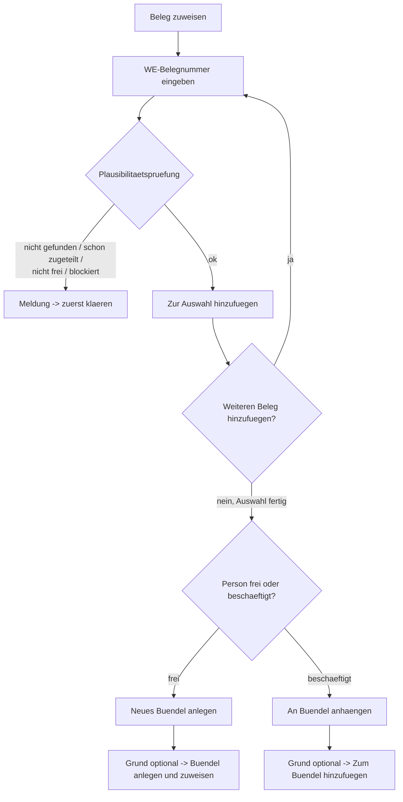

# B3 – Mitarbeiterboard

## Zweck

Das Mitarbeiterboard zeigt, wer an was arbeitet, wie ausgelastet jede Person ist, und lässt Belege
manuell zuweisen, entziehen, umsortieren oder pausieren.

## Wann anwenden

Zum Überblick über die Mannschaft, bei Engpässen/Überlast und für gezielte manuelle Eingriffe.

## Voraussetzungen

- Navigationseintrag `'Mitarbeiterboard'`.

## Zwei Ansichten: `'Liste'` und `'Board'`

Oben rechts neben der Überschrift `'Mitarbeiterboard'` schalten Sie zwischen zwei Darstellungen um;
die Wahl bleibt gespeichert:

- **`'Liste'`** – eine aufklappbare Zeile je Person (die folgenden Abschnitte).
- **`'Board'`** – das **Kanban-Raster**: je Person eine Karte, auf dem Desktop bis zu fünf Karten
  nebeneinander. Der Kopf jeder Karte zeigt Name, Skill-Stufe, `'frei'` bzw. den Bündel-Status oder
  `'Pausiert'`, die Last und offene Probleme. Darunter ist die Karte senkrecht in
  **`'Laufend (<n>)'`** (was die Person gerade bearbeitet) und **`'Geplant (<n>)'`**
  (Abholreihenfolge danach) geteilt; erledigte Belege stehen kompakt als Chips hinter
  `'Fertig (<n>):'`. Leere Bereiche sagen `'Nichts in Arbeit.'` bzw. `'Nichts geplant.'`. Über dem
  Raster wählen Sie die `'Sortierung'` (`'Standard'`, `'Frei → verplant'`, `'Verplant → frei'`,
  `'Profi zuerst'`, `'Starter zuerst'`) und filtern hinter `'Erfahrung:'` per Skill-Chips
  (`'Filter aufheben'` setzt zurück).

Jede **Beleg-Karte** im Raster zeigt die laufende Nummer mit der WE-Nummer, den Status-Chip, die
Schnellinfo `'!'` (Tooltip mit den Kopf-Infos des Belegs), ggf. die Lieferung und darunter
`'<n> Teile · <Minuten> · <Lagerplatz>'`. Am Griff (2×2 Punkte) ziehen Sie eine Karte auf eine
**andere** Person – das ist derselbe Eingriff wie `'Verschieben'` (siehe unten, mit Pflicht-Grund) –
oder innerhalb der eigenen Karte zwischen den **geplanten** Belegen, um die Reihenfolge zu ändern.
Alles läuft über dieselben Dialoge wie in der Liste; das Raster ist nur eine andere Oberfläche.

## Eine Zeile lesen

Jede Person ist eine aufklappbare Zeile. Die Kopfzeile zeigt:

- den Namen und eine **Skill-Stufe** als Chip (Tooltip `'Skill-Stufe: <Stufe>'`): `'Profi'`,
  `'Fortgeschritten'`, `'Basis'`, `'Starter'` oder `'Dummy'`;
- bei `'Starter'`/`'Dummy'` zusätzlich `'nur manuelle Zuteilung'`;
- bei freier Person `'frei'`;
- die Last: `'<n> Teile'`, Chip `'<Prozent> % verplant'` (Warnung > 95 %), `'<h> h geplant'`, die
  Bereiche und `'<n> Pkt · schwer <x>/leicht <y>'`;
- den **Bündel-Status** als Chip (z. B. `'Zugeteilt'`, `'In Bearbeitung'`, `'Abgeschlossen'`);
- offene Probleme als Chip und den Bündel-Fortschritt `'Beleg <i>/<gesamt>'`;
- bei Pause den Chip `'Pausiert'` (ersetzt den Status-Chip).

**Skill-Stufen verstehen:** Nur `'Profi'`, `'Fortgeschritten'` und `'Basis'` bekommen von der
Automatik **automatisch** Arbeit. `'Starter'` und `'Dummy'` erhalten **nur manuell** zugeteilte
Belege (kein Selbst-Nachziehen). Die Stufe steuert nur die Auto-Berechtigung – die Leistungsmessung
ist davon getrennt (siehe Temp-Kräfte in Kapitel B7).

## Aufgeklappte Zeile

Ist niemandem etwas zugewiesen: `'Frei — keine Belege zugewiesen.'` Sonst je Beleg (in Bündel-
Reihenfolge): laufende Nummer, Pfeile `'Nach oben'`/`'Nach unten'` (Reihenfolge), WE-Nr, Status,
Lieferung, `'<n> Teile'`, Knopf `'Details'`, `'Entziehen'` (rot) und `'Verschieben'`. Unten:

- **`'Beleg(e) zuweisen'`** (bzw. `'Bündel anlegen'`, wenn die Person frei ist);
- **`'Reihenfolge speichern'`** (aktiv, sobald umsortiert);
- **`'Pause/Abwesenheit'`** bzw. `'Pause beenden'`.

## Bündel anlegen: mehrere Belege in einem Schritt zuweisen (A1/A2)

Der Dialog erlaubt, **mehrere Belege** per WE-Nummer zu sammeln und **in einem einzigen,
atomaren Schritt** zuzuweisen — ideal, um einer Person direkt ein ganzes Bündel zu geben, statt
jeden Beleg einzeln nachzuklicken.

1. In der aufgeklappten Zeile `'Beleg(e) zuweisen'` (bzw. `'Bündel anlegen'`) klicken. Es öffnet
   der Dialog `'Beleg zuweisen — <Name>'`.
2. Geben Sie die **`'WE-Belegnummer'`** ein (Beispiel: `'z. B. WE-2026-01234'`). Der Beleg wird
   **live geprüft** (`'Beleg wird geprüft …'`).
2a. Während Sie tippen, erscheint darunter eine **Trefferliste** mit ähnlichen Belegen (WE-Nr,
    Bereich, Teile, Lieferung) — auch bei einer nicht exakten Eingabe. Klick oder Enter fügt den
    markierten Treffer zur Auswahl hinzu.
3. Die **Plausibilitätsprüfung** meldet, falls etwas nicht passt:
   - `'Kein Beleg mit dieser WE-Belegnummer gefunden.'`
   - `'Bereits zugeteilt an <Name> — erst entziehen, dann neu zuweisen.'`
   - `'Status „<Status>" ist nicht zuweisbar — nur freie Belege im Pool (ready).'`
   - `'Durch Datenqualität blockiert (Intake-Gate) — erst im Topf freigeben.'`
4. Passt der Beleg, sehen Sie eine Vorschau (WE-Nr, Bereich, `'<n> Teile'`, Lieferung). Bei
   Bereichsabweichung ein weicher Hinweis (`'Bereich-Hinweis: … Zuweisung bleibt möglich …'`).
   Mit **`'Zur Auswahl hinzufügen'`** landet der Beleg in der Auswahlliste unten; das Eingabefeld
   leert sich sofort für den nächsten WE-Nr.
5. Die **Auswahlliste** zeigt jeden gesammelten Beleg (WE-Nr, Bereich, Teile, Entfernen-Knopf `'×'`)
   sowie **`'Gesamt: <n> Teile'`** und die geschätzte Gesamtzeit. Übersteigt die Auswahl die freie
   Kapazität der Person, warnt `'… übersteigt die freie Kapazität von <Name> … Zuweisung bleibt
   möglich …'` (weiche Warnung, kein Block).
6. Ein Erklärkasten sagt, was mit der ganzen Auswahl passiert:
   - frei: `'Neues Bündel für <Name> anlegen'` – die ausgewählten Belege werden seine ersten
     Mitglieder, in der gesammelten Reihenfolge.
   - beschäftigt: `'An bestehendes Bündel anhängen'` – sie werden ans Ende angehängt.
7. Optional `'Grund (optional)'` (Schnellauswahl `'Kapazität frei'`, `'Prio-Beleg'`,
   `'Bereich-Aushilfe'`) — gilt für die ganze Auswahl.
8. Bestätigen mit `'Bündel anlegen & zuweisen (<n>)'` (frei) bzw. `'Zum Bündel hinzufügen (<n>)'`
   (beschäftigt).

**Alles-oder-nichts:** Scheitert einer der ausgewählten Belege (z. B. Tippfehler, in der Zwischen-
zeit anderweitig zugeteilt), wird die **gesamte** Zuweisung zurückgenommen — kein Beleg wird
angefasst, und die Fehlermeldung erscheint als Snackbar. Einfach die Auswahl korrigieren und erneut
bestätigen.

```mermaid
flowchart TD
    A[Beleg zuweisen] --> B[WE-Belegnummer eingeben]
    B --> C{Plausibilitaetspruefung}
    C -- nicht gefunden / schon zugeteilt /<br/>nicht frei / blockiert --> D[Meldung -> zuerst klaeren]
    C -- ok --> Z[Zur Auswahl hinzufuegen]
    Z --> W{Weiteren Beleg hinzufuegen?}
    W -- ja --> B
    W -- nein, Auswahl fertig --> E{Person frei oder beschaeftigt?}
    E -- frei --> F[Neues Buendel anlegen]
    E -- beschaeftigt --> G[An Buendel anhaengen]
    F --> H[Grund optional -> Buendel anlegen und zuweisen]
    G --> I[Grund optional -> Zum Buendel hinzufuegen]
```

## Durchsuchen & mehrere auswählen

Statt eine WE-Nummer einzutippen, kann auch **`'Durchsuchen & mehrere auswählen'`** geöffnet
werden: ein Filterbereich (Bereich-Chips, Shop, Filiale, Sortierung) mit einer Liste, in der
mehrere Belege per Checkbox markiert werden. **`'Auswahl übernehmen'`** überträgt alle markierten
Belege in dieselbe Auswahl wie oben — Bestätigung erfolgt danach genau wie gewohnt.

## Beleg zu anderer Person verschieben (B2)

`'Verschieben'` bei einem einzelnen Beleg öffnet `'<WE-Nr> verschieben'`: Ziel-Mitarbeiter im
Feld `'Ziel-Mitarbeiter'` wählen, `'Weiter'` klicken. Anschließend wie gewohnt einen **Grund
(Pflichtfeld)** angeben und bestätigen. Der Beleg wird in einem Schritt aus dem aktuellen Bündel
entfernt und dem Bündel der Zielperson zugeteilt (neu angelegt, falls diese noch keins hat).

## Geteilte Belege: goldene Karten und `'Aus geteiltem Beleg entfernen'`

Wird ein Beleg von mehreren Mitarbeitenden **gemeinsam** bearbeitet – die Mitarbeitenden laden sich
gegenseitig ein (Kapitel A7) oder Sie geben ihn über `'Gemeinsam zuweisen'` mehreren Personen
(Kapitel B2) –, ist er im Board **golden** hervorgehoben: in der Liste, im Kanban-Raster und im
Belegstrich der Matrix, jeweils mit goldenem Rahmen und Gruppen-Symbol. Zwischen der WE-Nummer und
`'<n> Teile'` steht mittig, mit wem:

- **`'mit <Name>'`**, wenn genau eine weitere Person beteiligt ist;
- **`'<n>×'`** bei mehreren – `<n>` zählt die Helfer, der Inhaber kommt hinzu. Der Tooltip listet
  alle Helfer mit ihrem Stand (der Inhaber ist die Person, in deren Zeile bzw. Bündel die Karte
  liegt); wer `'Teilbeleg erledigt'` gemeldet hat, steht grau.

Der Beleg liegt weiterhin **nur im Bündel des Inhabers** – dort sehen Sie die Karte. Die Helfer
haben ihn nicht im Bündel; bei ihnen zählt er nicht als Last. Fertige Belege behalten ihre
Beteiligten, sodass auch später sichtbar bleibt, dass zusammengearbeitet wurde.

**Helfer entfernen:** Ein Rechtsklick auf die goldene Karte (oder das kleine Personen-Symbol für
die Touch-Bedienung) öffnet je Helfer den Eintrag **`'Aus geteiltem Beleg entfernen: <Name>'`**.
Nach dem Pflicht-Grund (Vorschläge `'Anderweitig gebraucht'`, `'Falsch eingeladen'`,
`'Schichtende'`) sieht die Person den Beleg nicht mehr; in ihrem Verlauf unter `'Nachrichten'` steht
die Einladung als entfernt. Bereits geprüfte Positionen bleiben geprüft. Der **Inhaber** lässt sich
so nicht entfernen – dafür gibt es `'Entziehen'` und `'Verschieben'`; beides beendet die
Zusammenarbeit für alle Beteiligten, ebenso Stornieren und Parken.

## Sich selbst zuweisen

Über die Belege-Liste (Kapitel B2, `'Zuweisen'`) steht im Personen-Auswahlfeld ganz oben fett
`'Mir zuweisen (Teamleitung)'`.

## Entziehen, umsortieren, pausieren (mit Pflicht-Grund)

Diese Eingriffe verlangen einen **Grund (mindestens 3 Zeichen)** im Dialog `'Grund (Pflichtfeld)'`
(Helfertext: `'Wird mit vorheriger und neuer Zuordnung auditiert (§8.4).'`; bestätigen mit
`'Bestätigen'`, Kürzel Strg/Cmd+Enter):

- **Entziehen** – Titel `'<WE> von <Name> entziehen'`, „Beleg geht zurück in den Pool." Vorschläge:
  `'Überlastet'`, `'Falsch zugeteilt'`, `'Pause/Abwesenheit'`.
- **Reihenfolge speichern** – Titel `'Reihenfolge für <Name> speichern'`. Vorschläge:
  `'Laufweg optimiert'`, `'Prio vorgezogen'`.
- **Pause/Abwesenheit** – Titel `'<Name>: Pause/Abwesenheit'` bzw. `'<Name>: Pause beenden'`.
  Vorschläge: `'Pause'`, `'Krank'`, `'Andere Aufgabe'`, `'Zurück aus Pause'`.
- **Aus geteiltem Beleg entfernen** – nur bei goldenen Karten, je Helfer (siehe oben). Vorschläge:
  `'Anderweitig gebraucht'`, `'Falsch eingeladen'`, `'Schichtende'`.

## Zusammengehörige Lieferungen

Ist eine Lieferung auf mehrere Personen verteilt, warnt das Board oben:
`'… zusammengehörige Lieferung(en) … — bitte … einem Mitarbeiter zuweisen.'` Weisen Sie die
zusammengehörigen Belege möglichst **einer** Person zu (Kapitel B6).

## Was passiert danach

- Zuweisungen/Änderungen erscheinen sofort im Bündel der Person (Mitarbeiter-App) und in der
  Historie des Belegs.
- Ein entfernter Helfer sieht den Beleg sofort nicht mehr unter `'Geteilt mit dir'`; Entziehen,
  Verschieben, Stornieren oder Parken eines geteilten Belegs beenden die Zusammenarbeit für alle –
  geprüfte Positionen bleiben geprüft.

## Häufige Fehler / FAQ

- **`'Eingriff fehlgeschlagen.'`** – erneut versuchen; bleibt es, technische Ursache prüfen.
- **`'Entziehen'`/`'Verschieben'` ist grau** – die Person hat (noch) kein Bündel.
- **Zuweisung wird abgelehnt** – lesen Sie die Plausibilitätsmeldung; z. B. Beleg erst entziehen
  oder im Topf freigeben.
- **Bündel-Zuweisung schlägt komplett fehl** – einer der ausgewählten Belege ist nicht mehr
  zuweisbar (Tippfehler, zwischenzeitlich vergeben); Auswahl prüfen/korrigieren und erneut
  bestätigen — es wurde nichts angefasst.
- **`'Verschieben'` schlägt fehl** – der Beleg ist bereits in Bearbeitung (nicht mehr nur
  zugeteilt); erst wenn die Person noch nicht begonnen hat, kann verschoben werden.
- **Eine Karte ist golden und zeigt `'3×'`** – neben dem Inhaber helfen drei weitere Personen bei
  diesem Beleg mit (vier Beteiligte insgesamt); der Tooltip nennt die Helfer mit Namen und Stand.
  Den Ablauf aus Sicht der Mitarbeitenden beschreibt Kapitel A7.
- **`'Aus geteiltem Beleg entfernen'` bietet den Inhaber nicht an** – so gewollt: Der Inhaber trägt
  den Beleg im Bündel. Nutzen Sie `'Entziehen'` oder `'Verschieben'`; damit endet die Zusammenarbeit
  für alle Beteiligten.
