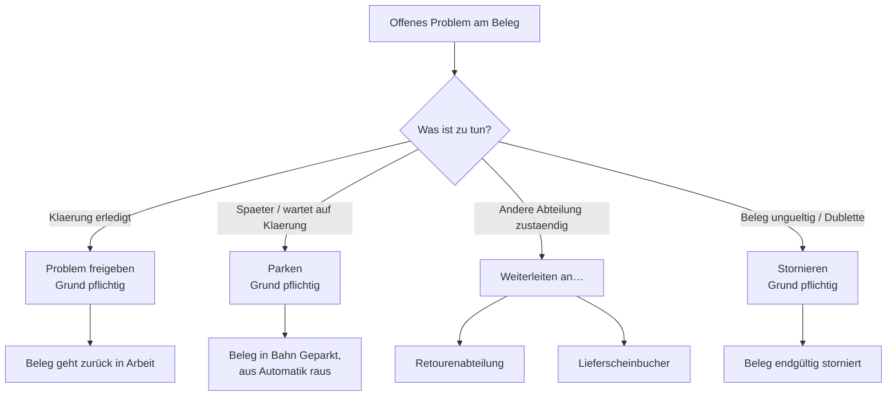

# B5 – Problem-Ablauf

> Dies ist **ein Beispiel-Kapitel unter vielen**. Der Problem-Ablauf zeigt exemplarisch, wie
> Teamlead-Entscheidungen an einem Beleg funktionieren – dieselben Aktionen gibt es auch für andere
> Situationen.

## Zweck

Einen gemeldeten Problemfall entscheiden: freigeben, parken, an eine Abteilung weiterleiten oder
stornieren.

## Wann anwenden

Sobald ein Beleg ein offenes Problem hat (Kennzeichen im Cockpit, in der Bahn `'Problemfälle'` oder
als Banner `'Offenes Problem: <Art>'` in der Beleg-Detailsicht).

## Voraussetzungen

- Der Beleg hat ein offenes Problem oder soll umgesteuert werden.

## Die Entscheidungswege

## Aktionen und Klickweg

Die Beleg-Aktionen finden Sie in der Kopfzeile der Beleg-Detailsicht, auf den Karten der Digitalen
Ablagen und teils in der Belege-Liste. Häufig genutzte Aktionen sind sofort sichtbar, weitere unter
`'Weitere Aktionen'`. Jede Aktion (außer Weiterleiten) verlangt einen **Pflicht-Grund** im Dialog
`'<Aktion> · Beleg <WE>'`.

| Aktion | Knopf-Beschriftung | Wirkung | Grund-Vorschläge |
|---|---|---|---|
| Problem freigeben | `'Problem freigeben'` | Löst das offene Problem; Beleg geht zurück in Arbeit. | `'Klärung erledigt'`, `'Daten korrigiert'` |
| Parken | `'Parken'` | Beleg in die Bahn `'Geparkt'`, aus der Automatik heraus. | `'Wartet auf Klärung'`, `'Unvollständige Ware'`, `'Rücksprache nötig'` |
| Entparken | `'Entparken'` | Holt einen geparkten Beleg zurück. | `'Klärung erledigt'`, `'Daten korrigiert'` |
| Stornieren | `'Stornieren'` | Beleg endgültig verwerfen. | `'Dublette'`, `'ERP-Korrektur'`, `'Fehlimport'` |
| Priorisieren | `'Priorisieren'` | Manuelle Prio (schlägt die Automatik). | `'Kunde wartet'`, `'Verladetag heute'`, `'Eskalation Markt'` |
| Priorität entfernen | `'Priorität entfernen'` | Hebt die manuelle Prio auf. | `'Doch nicht dringend'`, `'Korrektur'` |
| Zur Planung freigeben | `'Zur Planung freigeben'` | Gibt einen zu prüfenden Beleg in die Planung frei. | `'Daten geprüft'`, `'Klärung erledigt'` |
| Rest reaktivieren | `'Rest reaktivieren'` | Bringt die Restware eines Teilabschlusses zurück in den Pool. | `'Rest heute fertig'`, `'Kapazität frei'` |

Welche Aktionen erscheinen, hängt vom Status ab (z. B. bietet ein Problemfall
`'Problem freigeben'` und `'Stornieren'`; ein Teilabschluss `'Rest reaktivieren'`; ein fertiger oder
stornierter Beleg keine Aktionen mehr).

## Weiterleiten an eine Abteilung

Weiterleiten läuft über das Menü **`'Weiterleiten an…'`** (kein Pflicht-Grund) und ändert **nicht**
den Status – es markiert nur, wer als Nächstes handeln soll:

- `'Retourenabteilung'`
- `'Lieferscheinbucher'`

Ein weitergeleiteter Beleg liegt in der Bahn `'Weitergeleitet'` (nach Empfänger gruppiert) und zeigt
`'→ <Empfänger>'`. Zum Zurückholen dient `'Zurückholen'`.

## Was passiert danach

- **Freigeben**: Beleg ist wieder in Arbeit.
- **Parken**: Beleg liegt in `'Geparkt'`, wird nicht automatisch verteilt, bis Sie ihn entparken.
- **Weiterleiten**: Beleg wartet in `'Weitergeleitet'` auf die andere Abteilung.
- **Stornieren**: Beleg ist endgültig raus.
- Jede Aktion steht mit Zeit, Verursacher und Grund in der `'Historie'` des Belegs.

## Häufige Fehler / FAQ

- **Ich sehe die gewünschte Aktion nicht** – sie passt nicht zum aktuellen Status; prüfen Sie
  `'Weitere Aktionen'` oder den Status.
- **`'Bestätigen'` bleibt gesperrt** – der Pflicht-Grund braucht mindestens 3 Zeichen
  (`'Bitte mindestens 3 Zeichen angeben.'`).
- **Storno nicht möglich** – ein bereits in Arbeit befindlicher oder gebuchter Beleg lässt sich
  nicht mehr stornieren.
