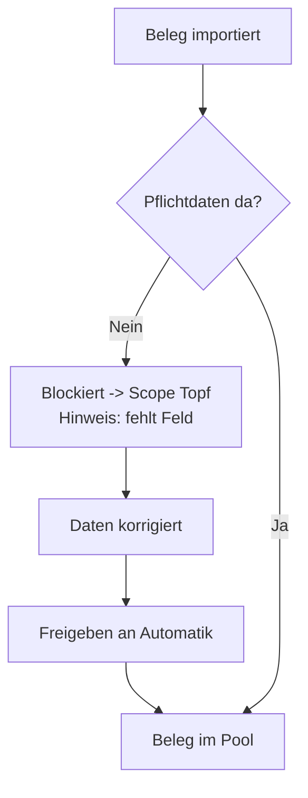

# B6 – Eingangssteuerung (Intake)

## Zweck

Die Eingangssteuerung sorgt dafür, dass nur **saubere, vollständige** Belege in die Verteilung
gelangen: fehlerhafte Datenqualität, unvollständige Lieferungen und sehr große Belege werden
gezielt zurückgehalten.

## Wann anwenden

Morgens beim Prüfen des `'Topf'` und immer, wenn ein Beleg blockiert ist oder eine Lieferung
unvollständig erscheint.

## 1. „Zurück an Bucher" – Datenqualität

Fehlen einem Beleg beim Import Pflichtdaten (z. B. Lagerplatz oder Lieferschein-Nr), wird er
**blockiert** und gelangt **nie** in den Verteil-Pool.

- Solche Belege finden Sie im Scope **`'Topf'`** (Kapitel B2) mit einem Hinweis `'fehlt: <Feld>'`.
- Sind die Daten korrigiert, geben Sie den Beleg über **`'Freigeben (an Automatik)'`** frei – er
  wechselt dann in den Pool.
- Im Zuweisen-Dialog erscheint für solche Belege die Meldung
  `'Durch Datenqualität blockiert (Intake-Gate) — erst im Topf freigeben.'`

## 2. Unvollständige Lieferungen (Pool-Hold)

Gehört ein Beleg zu einer Lieferung, zeigt die Beleg-Detailsicht das Panel `'Zugehörige Lieferung'`.
Ist die Lieferung unvollständig, warnt es:
`'<da> von <erwartet> Belegen da — <fehlt> noch nicht gebucht. Lieferung erst vollständig
bearbeiten.'`

Handlungsmöglichkeiten im Panel:

- **`'Lieferung bestätigen'`** – bestätigt eine nur vermutete Zusammengehörigkeit (erscheint bei
  passender Konfidenz).
- **`'Lieferung trennen'`** – löst die Gruppe auf.
- **`'Diesen Beleg entfernen'`** – nimmt den einzelnen Beleg aus der Gruppe.

Ziel ist, eine zusammengehörige Lieferung **einer** Person zuzuweisen – sonst sucht eine zweite
Person ein Paket, das bereits jemand hat. Das Board warnt zusätzlich, wenn eine Lieferung auf
mehrere Personen verteilt ist (Kapitel B3).

**Lieferungs-Kennzeichnung:** Der Chip `'Lieferung ×n'` zeigt die Zusammengehörigkeit; die Farbe/das
Symbol steht für die Sicherheit der Erkennung: 🟢 bestätigt, 🟡 wahrscheinlich, 🟠 vermutet, 🔒
gesperrt. Erkannt wird über „Lieferschein X von N", gleiche Lieferschein-Nr oder fortlaufende
Belegnummern (Kapitel B7).

## 3. Groß-Belege (Monster-Belege)

Sehr große Belege (ab der eingestellten Teile-Schwelle, Admin-Tab `'Bündel'`) werden **nicht
automatisch** verteilt, sondern warten auf Ihre **manuelle Entscheidung** im Pool. Sie weisen sie
gezielt zu (Kapitel B3) oder teilen sie über die Beleg-Aktion `'Aufteilen …'` auf mehrere Personen
auf. Hängt jemand noch an einem solchen großen Beleg (Teilabschluss offen), bekommt die Person am
Folgetag kein neues Starter-Pack, bis der große Beleg fertig ist.

## Was passiert danach

- Freigegebene Belege stehen der Automatik zur Verfügung.
- Vollständige/bestätigte Lieferungen können zusammen zugewiesen werden.
- Große Belege bleiben sichtbar im Pool, bis Sie entscheiden.

## Häufige Fehler / FAQ

- **Ein Beleg taucht nicht in der Verteilung auf** – er ist evtl. im `'Topf'` blockiert
  (`'fehlt: <Feld>'`) oder als Groß-Beleg zurückgehalten.
- **Eine Lieferung ist gesplittet** – über das Board-Warnbanner die Teile derselben Lieferung einer
  Person zuweisen.

---

*Redaktionshinweis siehe [Pflegehinweise](./pflegehinweise.md): Die Begriffe „zurück an Bucher" und
„trotzdem bearbeiten" beschreiben das fachliche Verhalten; im Cockpit heißen die zugehörigen Knöpfe
`'Freigeben (an Automatik)'` bzw. die Lieferungs-Aktionen im Panel `'Zugehörige Lieferung'`.*
