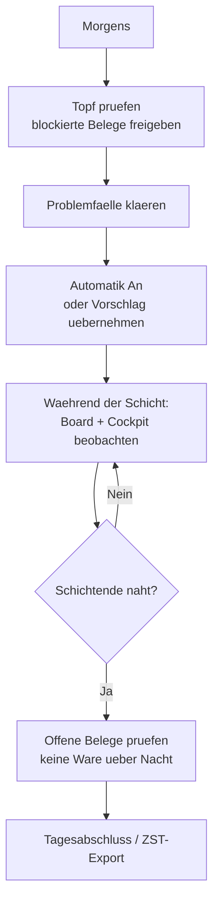

# B8 – Empfohlene Tagesroutine

## Zweck

Ein roter Faden für den Teamlead-Tag: was morgens, während der Schicht und zum Schichtende zu tun
ist.

## Wann anwenden

Täglich – als wiederkehrende Routine.

## Der Tag im Überblick

## Morgens

1. **`'Topf'` prüfen** (Kapitel B2/B6): blockierte Belege (`'fehlt: <Feld>'`) nach Korrektur über
   `'Freigeben (an Automatik)'` freigeben; Belege mit „Besonderer Aufmerksamkeit" abarbeiten.
2. **Problemfälle klären** (Kapitel B5): Bahn `'Problemfälle'` durchgehen – freigeben, parken,
   weiterleiten oder stornieren.
3. **Verteilung starten**: Bei `'Automatik An'` verteilt das Cockpit selbst. Bei `'Automatik Aus'`
   erst `'Vorschlag ansehen'` und dann `'Übernehmen'` bzw. `'Jetzt verteilen'`.
4. **Unvollständige/große Lieferungen** prüfen (Kapitel B6): zusammengehörige Lieferungen einer
   Person zuweisen, Groß-Belege bewusst entscheiden.

## Während der Schicht

- **Cockpit beobachten** (Kapitel B1): Plan-Status, `'Braucht dich:'`-Leiste, Auslastung.
- **Board nutzen** (Kapitel B3): Über-/Unterlast ausgleichen (zuweisen, entziehen, umsortieren).
- **Neu berechnen** bei Bedarf – ungefährlich, laufende Arbeit bleibt unangetastet.

## Zum Schichtende

- **`'Schichtende'`-Regel** (Kapitel B7): Der `'Auto-Stopp vor Schichtende (Min.)'` sorgt dafür,
  dass gegen Schichtende keine neuen Bündel mehr automatisch ausgegeben werden; den Rest ziehen die
  Mitarbeitenden selbst.
- **Offene Ware prüfen**: Erscheint im Cockpit der Hinweis
  `'<n> Beleg(e) noch offen, obwohl die Schicht … beendet ist …'`, diese Belege vor Schichtende
  klären – **keine offene Ware über Nacht**.

## Tagesabschluss / ZST

1. Belege-Ansicht, Scope `'Abgeschlossen'` (Kapitel B2).
2. **`'Tagesabschluss / ZST-Export'`** – erzeugt die Übergabedatei `zst-export-<Datum>.csv` und
   schließt die fertigen Belege endgültig ab (bereits Exportiertes wird nicht doppelt ausgegeben).

## Häufige Fehler / FAQ

- **Cockpit „Failed to fetch" / lädt nicht** – meist ist der Backend-Dienst nicht gestartet. In der
  Entwicklungsumgebung den Server-Stack starten (siehe interne Betriebsdoku); hält es an, IT/Technik
  informieren.
- **Belege bleiben abends offen** – frühzeitig auf den Cockpit-Hinweis achten und rechtzeitig
  umverteilen oder als Teilabschluss abschließen lassen.
