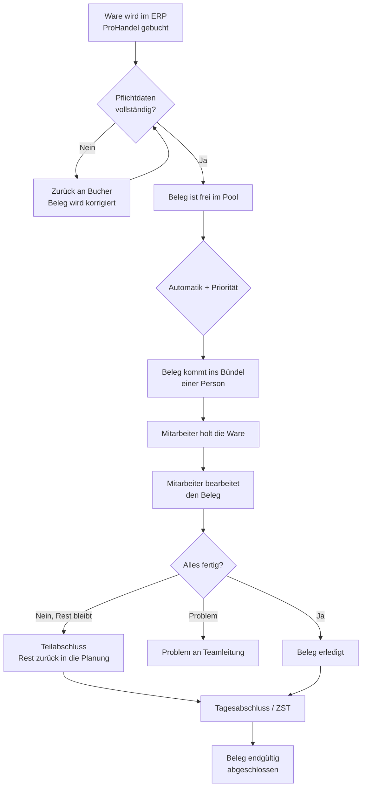

# Das große Bild – vom Wareneingang bis zum Tagesabschluss

Dieses Kapitel zeigt, wie ein Beleg durch den Tag läuft – von der Ankunft der Ware bis zum
Tagesabschluss. Wer den groben Weg kennt, versteht jede einzelne Bildschirm-Aktion leichter.

## Der Weg eines Belegs

## Die drei Bausteine

1. **Ankunft (ERP / ProHandel).** Die Ware wird im Warenwirtschaftssystem gebucht. Daraus entsteht
   automatisch ein Beleg. Fehlen Pflichtdaten (z. B. Lagerplatz oder Lieferschein-Nr), wird der
   Beleg **nicht** verteilt, sondern muss erst korrigiert werden („zurück an Bucher").

2. **Verteilung (Automatik + Priorität).** Vollständige Belege liegen frei im **Pool**. Die
   **Automatik** verteilt sie fair auf die eingeteilten Mitarbeitenden – nach **Schichtplan** (wer
   arbeitet heute wie lange) und **Priorität** (was ist am dringendsten). Zusammengehörige
   Lieferungen bleiben dabei möglichst bei **einer** Person.

3. **Abarbeitung bis Tagesabschluss.** Jede Person holt ihre Ware, bearbeitet die Belege und
   schließt sie ab. Am Ende des Tages macht die Teamleitung den **Tagesabschluss (ZST)** – fertige
   Belege werden ans Altsystem übergeben.

## Was ist Priorität?

Nicht jeder Beleg ist gleich dringend. Das System stuft jeden Beleg in eine feste Rangfolge ein –
die **Prioritäts-Leiter**. Die oberste passende Stufe gewinnt:

1. **Manuell (Teamlead)** – ein von Hand gesetzter Prio-Beleg schlägt alles.
2. **Prio** – Belege mit Prio-Kennzeichen.
3. **Tägliche Verladung** – Abschnitte 7, 4, 8 bzw. täglich verladende Shopbereiche.
4. **NOS & Hängeware** – NOS-Ware und alles aus dem Bereich Hängebahn.
5. **Verladeplan** – Abschnitte 1, 2, 3, fällig ab dem Verladetag.
6. **FIFO** – der Rest: das Älteste zuerst.

Details zur Leiter stehen in Kapitel **B7 – Admin & Regeln**.

## Wer entscheidet was?

- **Das System** entscheidet die Verteilung und die Reihenfolge (Fachlogik).
- **Die Apps** zeigen das Ergebnis an und führen durch die Arbeit – sie treffen keine eigenen
  fachlichen Entscheidungen.
- **Die Teamleitung** greift ein, wo nötig (zuweisen, parken, priorisieren, Probleme klären) –
  immer mit protokolliertem Grund.
- **Die Mitarbeitenden** holen, prüfen, erfassen und schließen ab – und melden Probleme.
