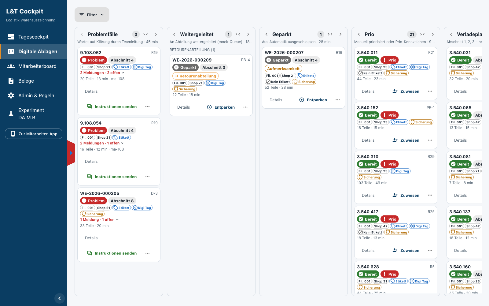
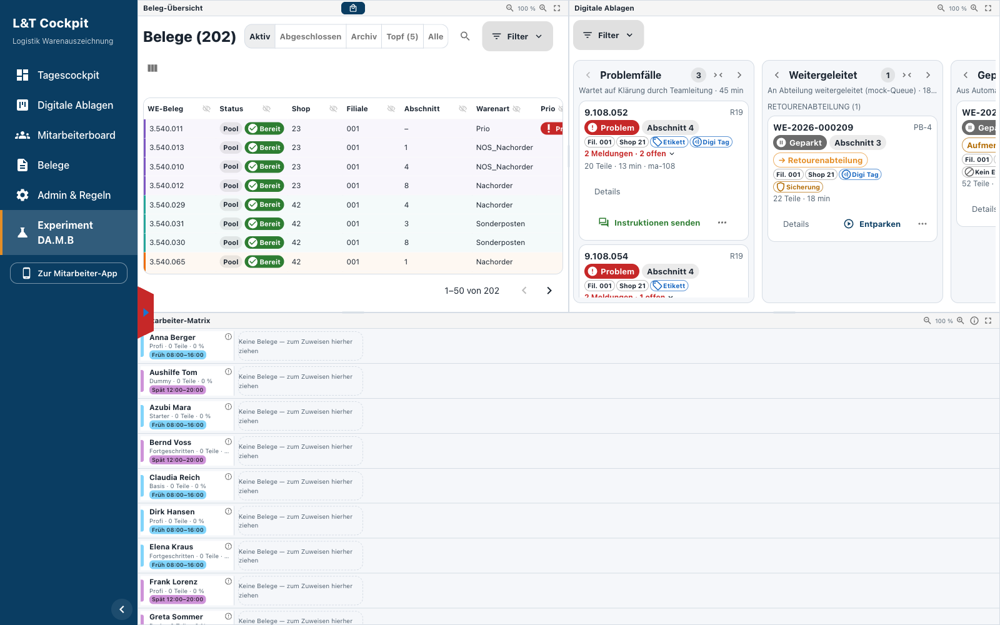
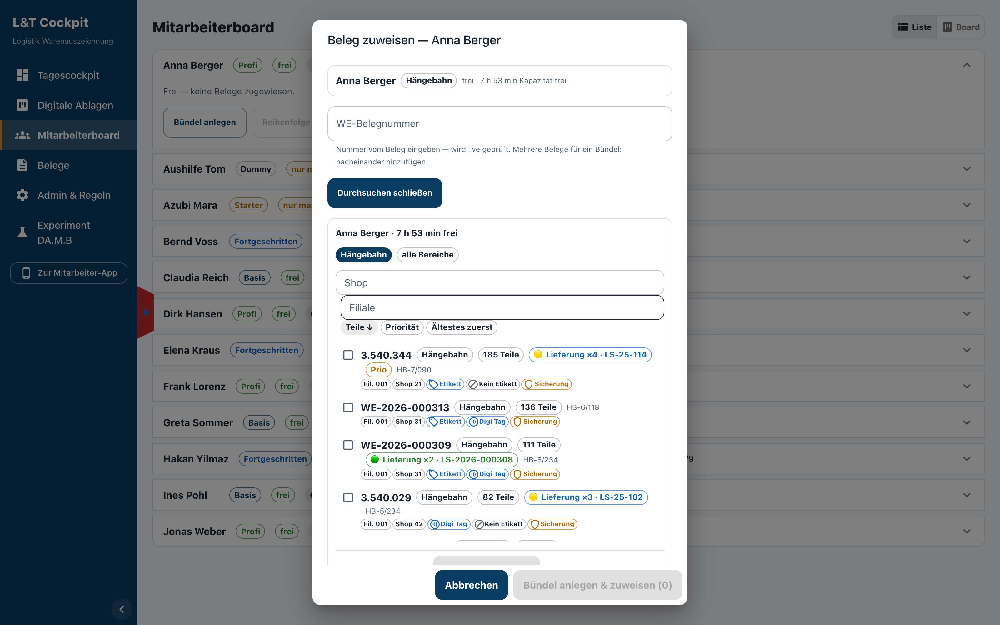
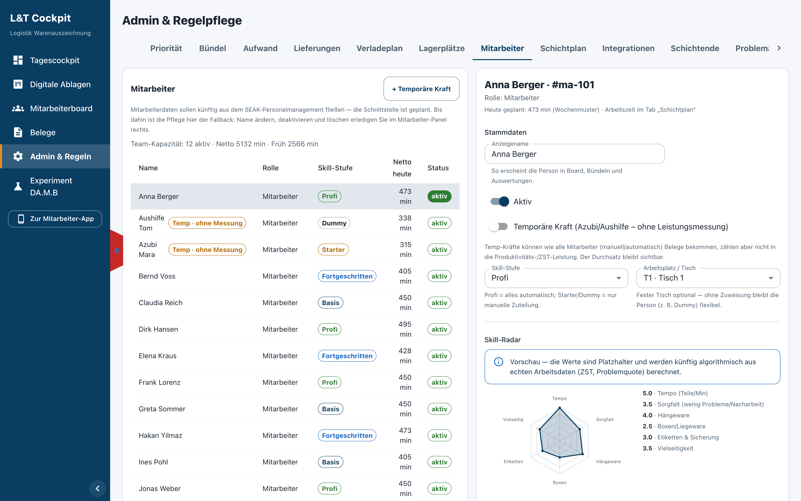
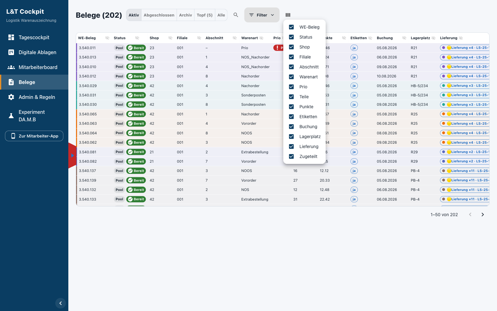
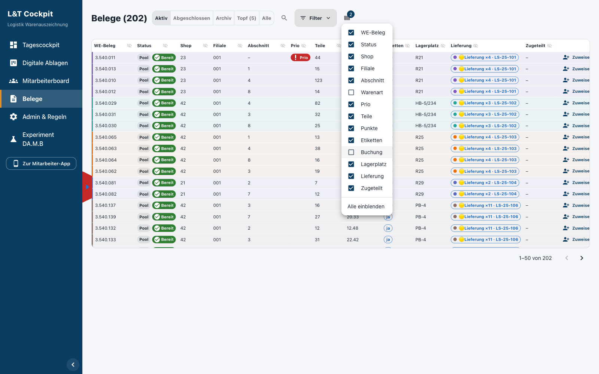
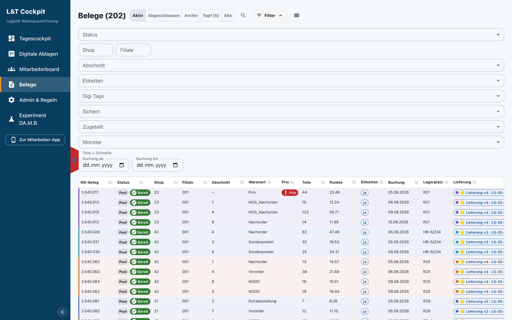
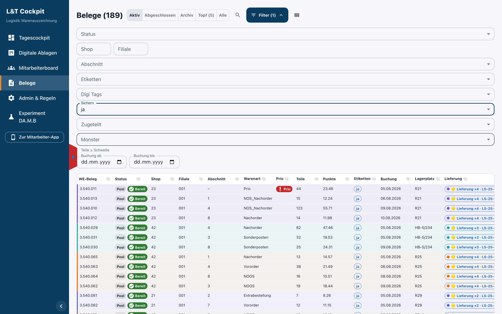
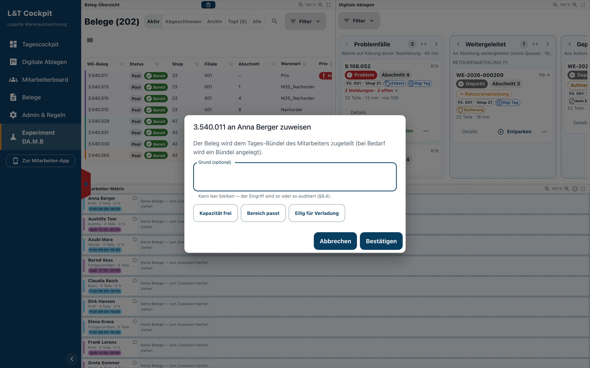

# Dashboard-Änderungen — Kundenfeedback vom 07.08.2026

## 1 · Digitale Ablage — Infos auf der Beleg-Kachel

**Gewünscht:** Filiale, Shop, Etiketten, Digi Tags und Sicherung kompakt auf jeder
Beleg-Kachel.

**Umgesetzt:** Eine schmale Chip-Zeile je Kachel.

- Filiale (`Fil. 001`)
- Shop, bei Mehr-Shop-Belegen mit Zähler (`Shop 21 +2`)
- Etikett-Varianten `Etikett`, `Digi Tag`, `Kein Etikett` — nur die, die auf dem Beleg
  vorkommen
- `Sicherung`, sobald mindestens eine Position gesichert werden muss
- Volle Bezeichnung jeweils im Tooltip

Die Angaben entstehen aus den hinterlegten Positionsdaten.

{width=16.5cm}

{width=16.5cm}

\newpage

## 2 · Mitarbeiterboard — „Bündel anlegen"

**Gewünscht:** Beim Auswählen der Belege je Zeile dieselben Infos wie auf den Kacheln.

**Umgesetzt:**

- Dieselbe Chip-Zeile in den Beleg-Zeilen des Zuweisen-Dialogs
- Gilt für die Live-Suche und für „Durchsuchen & mehrere auswählen"
- Gleiche Komponente wie auf den Ablagen-Karten

{width=16.5cm}

**Frage an Sie:** Der Reiter DA.M.B enthält dieselbe Mitarbeiter-Matrix, und jede
Mitarbeiter-Zeile lässt sich dort aufklappen. Das eigene Mitarbeiterboard wird damit
weitgehend überflüssig. Soll es raus?

\newpage

## 3 · Admin & Regeln — Skill-Radar statt Bereich/Skill

**Gewünscht, im Wortlaut:** *„Diese Bereiche werden grundsätzlich nicht benötigt … Es
gibt keine Mitarbeiter, die nur z. B. HW bearbeiten. Jeder MA macht alles."*

**Umgesetzt:**

- Bereichs-Auswahl aus der Mitarbeiter-Ansicht entfernt, keine Einstellmöglichkeit mehr
- Stattdessen ein Skill-Radar: 6 Achsen (Tempo, Sorgfalt, Hängeware, Boxen/Liegeware,
  Etiketten & Sicherung, Vielseitigkeit), Skala 0–5, reine Anzeige
- Die Werte sind Platzhalter und je Person fest; der Hinweis dazu steht über dem
  Diagramm. Später kommen sie aus ZST-Durchsatz und Problemquote
- Geändert wurde nur diese Ansicht — Verteilungslogik und übrige Ansichten sind
  unverändert

{width=16.5cm}

\newpage

## 4a · Belege-Tabelle — Spalten ausblenden

**Gewünscht:** Ausblenden über ein Icon im Spaltenkopf, Einblenden über ein
„Spalten"-Menü, Zustand über Reload gespeichert, getrennt je Ansicht.

**Umgesetzt:**

- Augen-Icon rechts in jedem Spaltenkopf blendet die Spalte aus; der Kopf-Klick sortiert
  weiterhin
- „Spalten"-Icon über der Tabelle: Checkbox-Liste aller Spalten, die Zahl am Icon zeigt
  die Anzahl ausgeblendeter Spalten, „Alle einblenden" stellt alles wieder her
- Zustand überlebt den Reload, getrennt für Belege-Reiter und DA.M.B
- Nicht ausblendbar: die Aktionen-Spalte und die jeweils letzte verbliebene Spalte

{width=16.5cm}

{width=16.5cm}

\newpage

## 4b · Belege-Tabelle — Filter „Digi Tags" und „Sichern"

**Gewünscht:** Zwei zusätzliche Filter — „Digi Tags" und „Sichern" — in beiden Ansichten.

**Umgesetzt:**

- Beide im Filterblock zwischen „Etiketten" und „Zugeteilt", jeweils mit „ja" und „nein"
- Filtern serverseitig über dieselbe Ableitung wie die Chips auf den Kacheln
- In beiden Ansichten verfügbar, da Belege-Reiter und DA.M.B dieselbe Tabelle verwenden

{width=16.5cm}

{width=16.5cm}

\newpage

## 5 · DA.M.B — Grund ist kein Pflichtfeld mehr

**Gewünscht:** Beim Zuordnen bzw. Hineinziehen eines Belegs zu einem Mitarbeiter oder
von Mitarbeiter zu Mitarbeiter soll der Grund optional sein; das Audit-Event soll
weiterhin geschrieben werden.

**Umgesetzt:**

- Feld heißt „Grund (optional)", „Bestätigen" ist bei leerem Feld anwählbar
- Vorschlags-Knöpfe bleiben als Abkürzung
- Audit-Event wird geschrieben, ohne Text wenn keiner eingegeben wurde
- Gilt für: Ablage → Mitarbeiter, vorbereitetes Bündel → Mitarbeiter, Mitarbeiter →
  Mitarbeiter, Pack → Pack, Einsortieren zwischen geplante Belege
- Weiterhin Pflicht: Pause/Abwesenheit und Entziehen eines Belegs

{width=16.5cm}

\newpage

## Zusammenfassung

| # | Punkt | Stand |
| --- | --- | --- |
| 1 | Kachel-Infos in der Digitalen Ablage (Original + DA.M.B) | umgesetzt |
| 2 | Gleiche Infos je Zeile beim „Bündel anlegen" | umgesetzt |
| 3 | Skill-Radar statt Bereich/Skill in Admin & Regeln | umgesetzt, Werte noch Platzhalter |
| 4a | Spalten ausblendbar, „Spalten"-Menü, je Ansicht gespeichert | umgesetzt |
| 4b | Filter „Digi Tags" und „Sichern" in beiden Ansichten | umgesetzt |
| 5 | Grund beim Zuordnen/Verschieben optional | umgesetzt |
