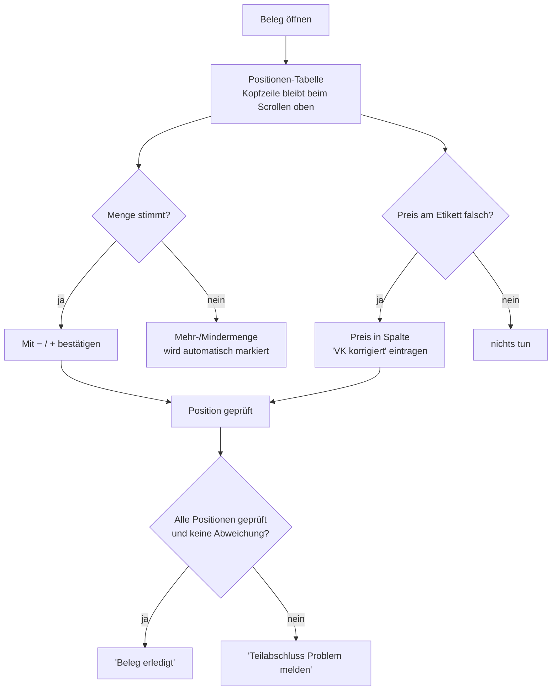

# Flow 1 — Positionen-Tabelle neu

> Kundenfeedback vom 14.07.2026 · PDF „20260713 – Mitarbeiterapp ändern"
> Betrifft den Bildschirm **Beleg bearbeiten → Positionen** in der Mitarbeiter-App.

## Worum es geht

Beim Auszeichnen einer Lieferung sieht der Mitarbeiter jetzt **alle Positionen des Belegs in
einer einzigen Tabelle**. Vier Wünsche aus dem Feedback wurden umgesetzt, damit die Tabelle beim
Abarbeiten großer Belege ruhig und eindeutig bleibt:

1. **CatMan-Termin pro Position** — statt eines bloßen Kennzeichens „CatMan" steht jetzt das
   konkrete **Datum** an der Position (z. B. `CatMan 17.06.2026`).
2. **Hauptshop & Shopnummer in der Position** — an jeder Position steht `HShop <Nr> · Shop <Nr>`,
   damit sofort klar ist, wohin die Ware gehört.
3. **Fixierte Tabellen-Kopfzeile** — die Spaltenüberschriften (`Pos`, `EAN`, `Größe`, `Soll`,
   `Ist`, …) **bleiben beim Scrollen oben stehen**. Auch bei 40 Größenzeilen weiß man in jeder
   Zeile, welche Spalte man gerade liest.
4. **Preisabweichung direkt an der EAN** — die neue Spalte **`VK korrigiert`** sitzt direkt hinter
   `VK-Etikett`. Weicht der Kassenpreis vom Etikett ab, trägt man ihn **in derselben Zeile** ein –
   kein separater Dialog mehr.

## Vorher / Nachher

| | Vorher | Nachher |
|---|---|---|
| CatMan | nur ein Chip `Catman` (ohne Datum) | Chip mit Datum `CatMan 17.06.2026` |
| Shop-Zuordnung | nur `Shop <Nr>` | `HShop <Nr> · Shop <Nr>` + `Order <Nr>` |
| Kopfzeile | scrollt mit weg | **bleibt oben stehen** (fixiert) |
| Preiskorrektur | nicht an der Zeile möglich | Spalte **`VK korrigiert`** direkt hinter `VK-Etikett` |

Das *Vorher* zeigt der echte Screenshot der alten Tabelle:
`assets/vorher-positionen-tabelle.png` (ohne Spalte „VK korrigiert", CatMan ohne Datum, kein
HShop). Das *Nachher* zeigt der App-Mockup im Präsentations-Viewer (`index.html`).

## Ablauf aus Sicht des Mitarbeiters

## Schritt für Schritt

1. **Beleg öffnen.** Oben steht groß die WE-Beleg-Nr., z. B. `WE 3.540.634`, darunter die
   Kartonzahl `📦 1 Karton – alle auf dem Karren suchen!`.
2. **Arbeitsanweisung lesen** (eigener Kasten `Arbeitsanweisung`). Die Prüfstufe wird über das
   Info-Symbol `ⓘ` als Tooltip erklärt.
3. **Positionen-Tabelle abarbeiten.** Über der Tabelle steht der Hinweis
   `Jede Position prüfen – auch bei Prüfung Wareneingang = „Nein".` Jede Position hat einen
   Kopfblock mit:
   - `Pos <Nr>`, Lieferanten-Artikelnummer · Farbe,
   - **`HShop <Nr> · Shop <Nr>`** und **`Order <Nr>`** (Ordernummer zur Fehlerlösung),
   - `WGR <Nr> <Bezeichnung>` (Warengruppe im Klartext), ggf. `· Saison <…>`,
   - Kennzeichen nur wenn zutreffend: `♻️ NOS`, **`CatMan 17.06.2026`**, `🏷️ Etikett`,
     `🔒 Sicherung`, `🌐 Online`, `🔴 Rotpreis`,
   - rechts `Soll gesamt <Menge>`, den Knopf **`Position geprüft`** und den roten Knopf
     **`Problem`**.
4. **Menge je Größe erfassen.** Jede Größe ist eine eigene Zeile mit den Spalten `EAN`, `Größe`,
   `Soll`, `Ist` (mit `−` / `+`), `Mehr-/Mindermenge`, `EK`, `VK`, `VK-Etikett`, `VK korrigiert`.
   Weicht die Menge ab, erscheint automatisch der Chip `+<n> Mehrmenge` bzw. `−<n> Mindermenge`
   und die **ganze Zeile wird rot markiert**.
5. **Preis korrigieren** (falls nötig). In der Spalte **`VK korrigiert`** den tatsächlichen Preis
   eintragen (Feld `Preis`). Auch das markiert die Zeile rot – es ist automatisch ein Problem
   (siehe Flow 2).
6. **Position abschließen** mit **`Position geprüft`** → der Knopf wird zum grünen Chip
   `Position geprüft ✓`.
7. Wenn alle Positionen geprüft sind und **keine** Abweichung vorliegt, wird unten
   **`Beleg erledigt`** aktiv. Bei Abweichung bleibt nur **`Teilabschluss (Problem melden)`**
   (siehe Flow 3).

## Warum das für L&T besser ist

- **Weniger Suchen:** HShop/Shop/Order und CatMan-Datum stehen direkt an der Ware.
- **Kein Verrutschen:** die fixierte Kopfzeile hält die Spalten auch bei langen Belegen im Blick.
- **Preiskorrektur ohne Umweg:** ein Feld an genau der Zeile, zu der es gehört.
