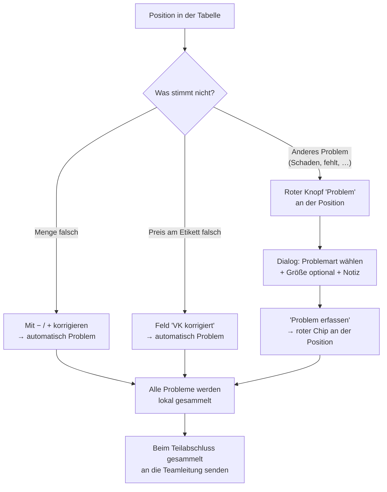

# Flow 2 — Problem-Workflow neu

> Kundenfeedback vom 14.07.2026 · PDF „20260713 – Mitarbeiterapp ändern"
> Betrifft das Melden von Problemen in der Mitarbeiter-App und die Pflege der Problemarten im
> Teamlead-Cockpit.

## Worum es geht

Der alte Problem-Ablauf hatte eine **feste Liste** von Problemarten und einen **beleg-weiten**
Knopf „Problem melden". Das passte nicht zur Praxis: Probleme hängen fast immer an **einer
bestimmten Position/Größe**, und L&T möchte die Problemarten **selbst pflegen** können.

Neu ist:

1. **Frei definierbare Problemarten.** Die Teamleitung pflegt den Katalog im Cockpit
   (`Admin → Problemarten`). Was dort aktiv ist, kann der Mitarbeiter auswählen.
2. **Problem pro Position/Größe** — erfasst über den roten Knopf **`Problem`** an der Position,
   mit **farblicher Markierung** der betroffenen Zeile/Position.
3. **Kein beleg-weites „Problem melden" mehr.** Der frühere Sammel-Knopf am Beleg ist entfallen.
4. **Automatische Probleme.** Eine **Mehr-/Minderlieferung** oder eine **Preisabweichung** ist
   **automatisch ein Problem** – man muss nichts extra melden.
5. **Sammel-Meldung erst beim Teilabschluss.** Alle erfassten Probleme werden **gesammelt** und
   erst beim Teilabschluss an die Teamleitung gesendet (siehe Flow 3).

## Vorher / Nachher

| | Vorher | Nachher |
|---|---|---|
| Problemarten | feste Enum-Liste im Code | **frei pflegbarer Katalog** (`Admin → Problemarten`) |
| Einstieg | beleg-weiter Knopf `Problem melden` | roter Knopf `Problem` **an der Position** |
| Mengen/Preis | separat gemeldet | **automatisch** ein Problem |
| Senden | sofort einzeln | **gesammelt beim Teilabschluss** |
| Sichtbarkeit | Liste ohne Bezug zur Ware | betroffene **Zeile/Position rot markiert** |

## Ablauf aus Sicht des Mitarbeiters

## Schritt für Schritt (Mitarbeiter)

1. **Anderes Problem an einer Position** (kein Mengen-/Preisfall): roten Knopf **`Problem`** in der
   Positions-Kopfzeile tippen. Es öffnet der Dialog **`Problem melden – Position <Nr>`**.
2. Im Dialog steht der Hinweis
   `Das Problem wird beim Teilabschluss gesammelt an die Teamleitung gesendet.`
   - **`Problemart`** (Pflichtfeld) — Auswahl aus dem vom Teamlead gepflegten Katalog.
   - **`Größe (optional)`** — `Ganze Position` oder eine konkrete Größe/EAN.
   - **`Notiz (optional)`** — Freitext.
3. Mit **`Problem erfassen`** speichern. An der Position erscheint ein **roter Chip** mit dem Grund
   (und ggf. der Notiz); er lässt sich per `×` wieder entfernen.
4. **Mengen- und Preisabweichungen** muss man **nicht** über den Dialog melden – sie werden an der
   Zeile mit `−`/`+` bzw. im Feld `VK korrigiert` erfasst und **automatisch** zum Problem. Die
   betroffene Zeile wird rot hinterlegt.
5. Solange ein Problem vorliegt, ist **`Beleg erledigt`** gesperrt – der Beleg geht über
   **`Teilabschluss (Problem melden)`** an die Teamleitung (Flow 3).

## Schritt für Schritt (Teamleitung — Problemarten pflegen)

Im Cockpit unter **`Admin → Problemarten`**:

1. Die Tabelle zeigt die Spalten `Reihenfolge`, `Bezeichnung`, `Aktiv`, `Aktion`.
2. Mit **`Neue Problemart`** eine Zeile anlegen und die **`Bezeichnung`** eintragen.
3. Reihenfolge über die Pfeile ↑/↓ sortieren; über den Schalter **`Aktiv`** einen Grund für die
   App freigeben oder ausblenden.
4. **`Speichern`** → Bestätigung `Problemarten gespeichert.` Die App lädt den neuen Katalog
   automatisch.

> Hinweis (aus der App-Beschreibung): „Frei definierbare Gründe, die der Mitarbeiter beim Melden
> eines Positions-Problems auswählen kann. Inaktive Gründe sind in der App nicht wählbar. Bereits
> gemeldete Probleme behalten ihren Grund-Text, auch wenn er später geändert wird."

## Automatische Problemarten (fest)

Neben den frei definierbaren Gründen gibt es drei **feste, automatische** Arten:

- **`Mehrlieferung`** — mehr Teile als Soll,
- **`Minderlieferung`** — weniger Teile als Soll,
- **`Preisabweichung`** — korrigierter VK ≠ VK-Etikett.

## Warum das für L&T besser ist

- **L&T pflegt die Problemarten selbst** – ohne Entwickler.
- **Jedes Problem hängt an der konkreten Ware** – die Teamleitung sieht sofort, worum es geht.
- **Nichts geht verloren:** Mengen-/Preisabweichungen sind automatisch Probleme.
