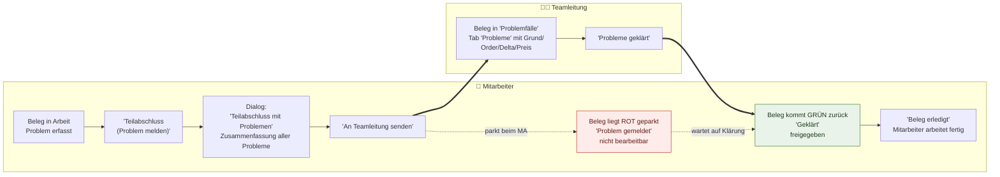
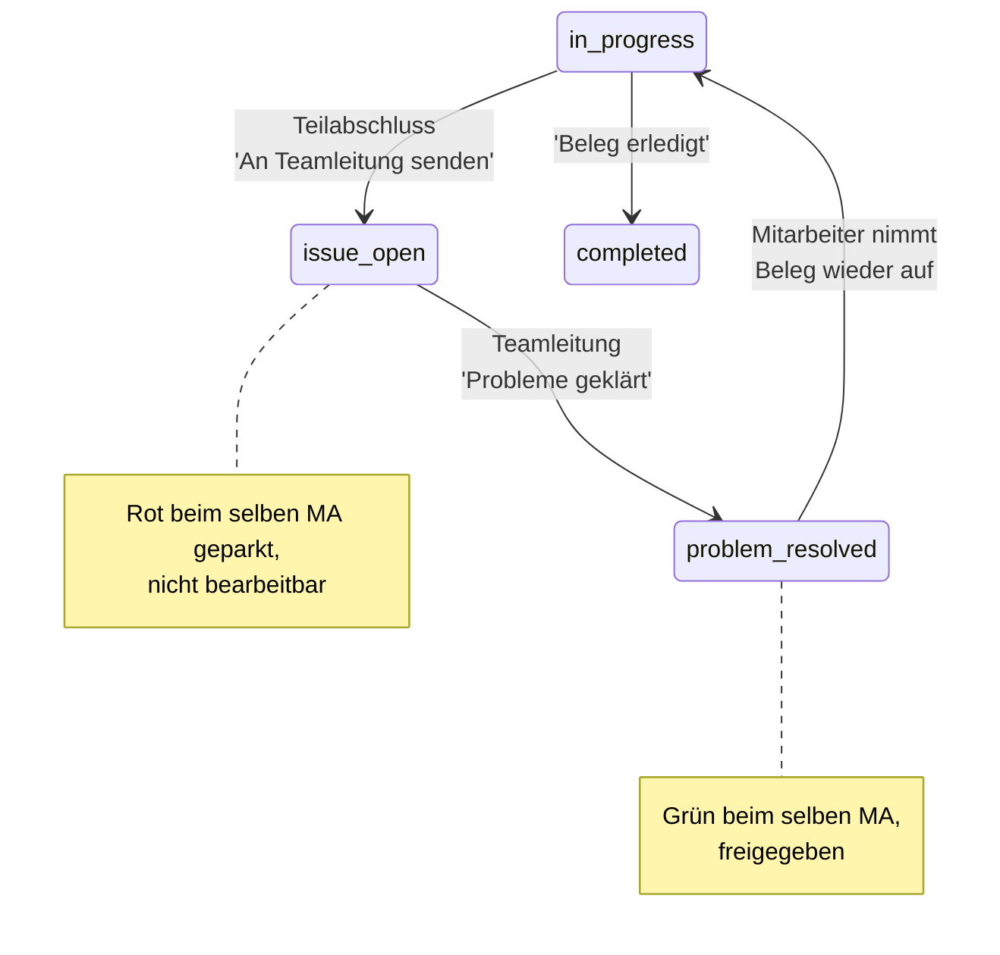

# Flow 3 — Teilabschluss-Loop neu (Mitarbeiter ↔ Teamleitung)

> Kundenfeedback vom 14.07.2026 · PDF „20260713 – Mitarbeiterapp ändern"
> Betrifft den Teilabschluss in der Mitarbeiter-App und die Klärung im Teamlead-Cockpit.
> **Das ist der zentrale neue Kreislauf.**

## Worum es geht

Früher öffnete der Teilabschluss einen **Freitext-Grund-Dialog**, und der Rest des Belegs ging
zurück in den Topf – der Beleg konnte danach bei **irgendjemandem** landen. L&T wollte einen
**geschlossenen Kreislauf** zwischen Mitarbeiter und Teamleitung:

1. **Teilabschluss ohne Freitext-Dialog.** Statt eines Grund-Feldes zeigt der Teilabschluss eine
   **Zusammenfassung aller gesammelten Probleme** und sendet sie an die Teamleitung.
2. **Der Vorgang geht an die Teamleitung** – nicht zurück in den offenen Topf.
3. **Beim selben Mitarbeiter rot geparkt.** Der Beleg bleibt in **seiner** Liste, rot markiert,
   **nicht bearbeitbar**, bis geklärt ist.
4. **Nach Klärung grün.** Die Teamleitung klärt und gibt frei; der Beleg kommt **grün markiert** zum
   **selben Mitarbeiter** zurück.
5. **Selber Mitarbeiter arbeitet fertig.** Er nimmt den geklärten Beleg wieder auf und schließt ihn
   ab.

## Der zentrale Kreislauf

## Status-Fluss im Hintergrund

## Schritt für Schritt (Mitarbeiter → Teilabschluss)

1. Solange eine Abweichung oder ein Problem vorliegt, ist **`Beleg erledigt`** gesperrt. Unten steht
   **`Teilabschluss (Problem melden)`**.
2. Tippen öffnet den Dialog **`Teilabschluss mit Problemen`** mit dem Hinweistext:
   > „Der Vorgang geht mit den folgenden Problemen zur Fehlerbehebung an die Teamleitung. Bis zur
   > Klärung bleibt er in deiner Liste rot geparkt und ist nicht bearbeitbar. Sobald die Teamleitung
   > geklärt hat, kommt er grün markiert zu dir zurück."
3. Darunter stehen **alle gesammelten Probleme** – manuelle Gründe **und** automatische
   (`Mehrlieferung +n`, `Minderlieferung −n`, `Preisabweichung … VK-Etikett → korrigiert …`).
4. Mit **`An Teamleitung senden`** abschicken. (Ohne Problem erscheint stattdessen der Hinweis
   `Es ist noch kein Problem erfasst. Ohne Problem bitte „Beleg erledigt" verwenden.`)
5. Auf dem Startbildschirm liegt der Beleg jetzt **rot** mit dem Status **`Problem gemeldet`** und
   dem Zusatz `Wartet auf Klärung durch die Teamleitung – nicht bearbeitbar.` **Er lässt sich nicht
   öffnen.**

## Schritt für Schritt (Teamleitung → Klärung)

1. Der Beleg erscheint im Cockpit in der Ablage-Spalte **`Problemfälle`** und im Beleg unter dem
   Tab **`Probleme`**.
2. Der Tab zeigt am Kopf `WE-Nr` + `Lieferschein` und den Hinweis
   `Ordernummer je Position bei den einzelnen Problemen.` Jedes Problem listet Grund/Art, Position,
   ggf. EAN/Größe, Mengen-Delta und Preis-Korrektur.
3. Über die Aktion **`Probleme geklärt`** (Header-Aktionsleiste) den Beleg freigeben. Hinweis im
   Tab: `Nach „Probleme geklärt" geht der Beleg grün markiert zurück an den Mitarbeiter zur
   Weiterbearbeitung.`

## Schritt für Schritt (Mitarbeiter → fertigstellen)

1. Der Beleg liegt nun **grün** mit Status **`Geklärt`** und dem Zusatz
   `Geklärt – zur Weiterbearbeitung freigegeben.` in **seiner** Liste.
2. Er öffnet ihn, arbeitet den Rest ab und schließt mit **`Beleg erledigt`** ab.

## Warum das für L&T besser ist

- **Ein geschlossener Kreis:** derselbe Mitarbeiter, der das Problem kennt, macht den Beleg fertig.
- **Nichts bleibt liegen:** rot geparkt = eindeutig, dass die Teamleitung dran ist.
- **Kein Freitext-Zwang:** der Teilabschluss zeigt genau, was gemeldet wird, ohne Tipparbeit.
