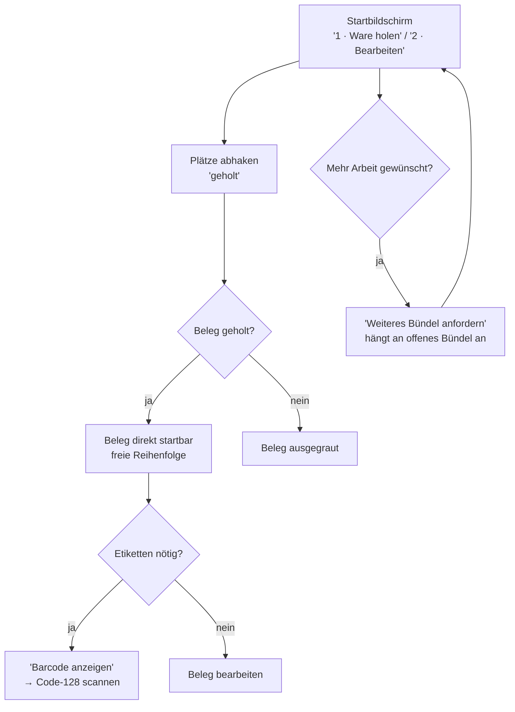

# Flow 4 — Bündel & Home-Screen neu

> Kundenfeedback vom 14.07.2026 · PDF „20260713 – Mitarbeiterapp ändern"
> Betrifft den **Startbildschirm** der Mitarbeiter-App.

## Worum es geht

Der Startbildschirm war zu starr: man musste **erst alles holen**, bevor man loslegen durfte, und
konnte kein weiteres Bündel anfordern. Vier Wünsche wurden umgesetzt:

1. **Weiteres Bündel auf eigenen Wunsch.** Der Mitarbeiter kann jederzeit selbst
   **`Weiteres Bündel anfordern`** – auch bei offenem Bündel. Die neuen Belege werden an das offene
   Bündel angehängt. Die Entscheidung liegt beim Mitarbeiter.
2. **Reichere Beleg-Übersicht.** Jede Beleg-Karte zeigt **WE-Beleg-Nr**, **Filiale**,
   **Shopbereich** und die **Etikettenart** (`🏷️ Etikettendruck` oder `Digitale Etiketten`).
3. **WE-Nr als aufklappbarer Barcode.** Über **`Barcode anzeigen`** klappt an jedem Beleg ein
   **Code-128-Barcode** der WE-Nr auf – zum Etiketten-Anfordern per Scanner.
4. **Freie Abarbeitungsreihenfolge.** Kein Zwang „Start Bearbeitung WE x" mehr: **jeder geholte
   Beleg** ist direkt startbar. Nur noch-nicht-geholte Belege bleiben ausgegraut.

## Vorher / Nachher

| | Vorher | Nachher |
|---|---|---|
| Weiteres Bündel | nicht möglich | **`Weiteres Bündel anfordern`** jederzeit |
| Beleg-Karte | nur WE-Nr + Lagerplatz | WE-Nr + **Filiale** + **Shopbereich** + **Etikettenart** |
| Etikett anfordern | — | **`Barcode anzeigen`** → Code-128 der WE-Nr |
| Reihenfolge | Zwang „erst alles holen" (`Erst Ware holen (0/4)`) | **frei** – jeder geholte Beleg direkt startbar |

Das *Vorher* zeigt der echte Screenshot: `assets/vorher-startseite.png` (unten der gesperrte Knopf
`Erst Ware holen (0/4)`, Belege nur mit WE-Nr + Lagerplatz, kein „Weiteres Bündel", kein Barcode).
Das *Nachher* zeigt der App-Mockup im Präsentations-Viewer (`index.html`).

## Ablauf aus Sicht des Mitarbeiters

## Schritt für Schritt

1. **Begrüßung & Arbeitsplatz.** Oben `Guten Morgen/Tag/Abend, <Name>` und `Arbeitsplatz: <Tisch>`.
2. **Abschnitt `1 · Ware holen`.** Liste der Lagerplätze in Sammel-Reihenfolge, mit Zähler
   `<geholt>/<gesamt> Plätze`. Jede Karte zeigt den Lagerplatz groß und die enthaltenen Belege als
   Chips `WE <Nr>` (bei Druckpflicht `· 🏷️ Etiketten drucken`). Tippen (oder Scannen) schaltet die
   Karte auf **`geholt`**. Ist der Karren voll, kann man mit **`Rest parken (<n> Belege)`** die noch
   nicht geholten Belege zurückgeben.
3. **Abschnitt `2 · Bearbeiten`.** Solange nicht alles geholt ist, steht der Hinweis
   `Ausgegraute Belege erst holen — geholte Belege kannst du in beliebiger Reihenfolge starten.`
   Jede Beleg-Karte zeigt:
   - ein Warenart-Icon (Regal 🗄️ / Palette 🟧 / Hängeware 🧥 / gemischt 📦),
   - **`WE <Nr>`** (fett),
   - **`Filiale <Nr> · Shopbereich <Nr>`**,
   - **`🏷️ Etikettendruck`** oder **`Digitale Etiketten`**,
   - ggf. eine Warenart wie `Vororder`/`NOS` und einen Status-Chip.
4. **Etiketten anfordern.** An jedem Beleg **`Barcode anzeigen`** tippen → es klappt der
   **Code-128-Barcode** der WE-Nr mit Klarschrift auf (erneut tippen: `Barcode ausblenden`). Den
   Barcode kann der Etikettendrucker/Scanner lesen.
5. **Frei starten.** Jeden **geholten** Beleg direkt durch Tippen öffnen – in beliebiger
   Reihenfolge. Ausgegraute Belege erst holen.
6. **Weiteres Bündel.** Unten fest steht **`Weiteres Bündel anfordern`** (bei offenem Bündel) bzw.
   **`Nächstes Bündel holen`** (wenn keins offen oder alles fertig). Ist das Bündel fertig,
   erscheint `Bündel fertig 🎉`.

## Sonderfälle (Klartext-Meldungen)

- Kein Bündel: `Kein Bündel zugeteilt. Du kannst unten selbst ein Bündel anfordern oder dich an den
  Teamlead wenden.`
- Nichts frei: `Aktuell nichts frei zum Holen.`
- Schichtende: `Schichtende – kein neues Bündel mehr, damit nichts offen liegen bleibt.`
- Feierabend: `Feierabend – Tageskapazität erreicht.`

## Warum das für L&T besser ist

- **Selbstbestimmtes Tempo:** wer schneller ist, fordert selbst nach.
- **Weniger Rückfragen:** Filiale/Shopbereich/Etikettenart stehen direkt auf der Karte.
- **Etiketten per Scan:** der aufklappbare Barcode ersetzt manuelles Nachschlagen.
- **Keine Wartezeit:** man startet den ersten geholten Beleg sofort, ohne auf den Rest zu warten.
